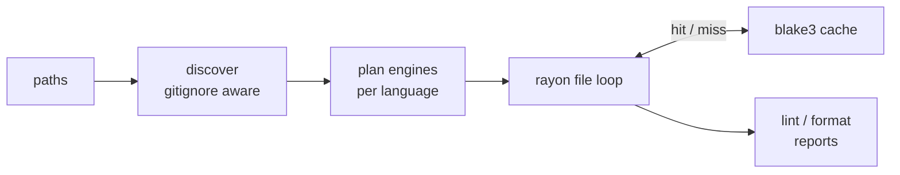

<!-- markdownlint-disable MD033 MD041 -->
<div align="center">


**The polyglot lint and format pipeline for whole repositories.**

Polylint ships the `poly` CLI: one config, one Rust pipeline, curated in-process backends,
tree-sitter fallback for everything else, and repo-wide cache + parallel execution. No language
runtime is required for the default path; `gofmt` and `rustfmt` are used when present, and other
external tools are opt-in.

Lint + format · one `poly.toml` · pure Rust default · blake3 cache · rayon parallelism · hooks +
commit checks · JSON + TOON + MCP

[](https://github.com/Goldziher/polylint/actions/workflows/ci.yaml)
[](https://www.npmjs.com/package/@nhirschfeld/polylint)
[](https://pypi.org/project/polylint/)
[](LICENSE)

[Install](#installation) · [Quickstart](#quickstart) · [What You Get](#what-you-get) ·
[How It Works](#how-it-works) · [Backends](#backend-coverage) · [CLI](#cli-reference)

</div>

---

## Quickstart

```console
$ poly fmt --check
would format crates/example/src/main.rs

$ poly fmt --fix
formatted 1 file

$ poly lint --format toon
path: crates/example/src/main.rs
diagnostics[0]: engine=ruff, code=F401, severity=warning, title="`os` imported but unused"

$ poly hooks install
installed git hooks: pre-commit, commit-msg
```

`poly fmt` is a dry run by default (CI-friendly); add `--fix` to write changes, and `poly lint
--fix` to apply lint autofixes. `poly hooks install` wires the git hooks once — lint, format, and
commit checks then run on every `git commit`.

---

## What You Get

<!-- markdownlint-disable MD013 -->

| Capability | What it does | Main surfaces |
|---|---|---|
| **Repo-wide lint + format** | Discovers files, routes each language to the best available backend, and reports normalized diagnostics and formatting drift. | `poly lint` · `poly fmt` |
| **One config** | `poly.toml` drives linting, formatting, hooks, commit-message policy, cache settings, and optional tool catalog entries. | `[defaults]` · `[lint.*]` · `[fmt.*]` · `[hooks]` · `[tools]` |
| **Curated Rust backends** | Wraps high-quality Rust libraries in-process: oxc, ruff internals, taplo, rumdl, sqruff, malva, markup_fmt, mago, and more. | Backend registry |
| **Generic fallback** | Uses `tree-sitter-language-pack` for identified languages without a dedicated backend, reindenting supported grammars and normalizing whitespace where safe. | `treesitter` tier |
| **Cache + parallelism** | Runs per file with rayon and skips unchanged work with a blake3 content-hash cache keyed by file bytes, engine, version, and resolved config. | `poly cache` · `--no-cache` · `-j` |
| **Git hooks** | Runs first-class builtins and inline hook jobs from `poly.toml`, with file-safety checks and Cargo tools available as builtins. | `poly hooks install` · `poly hooks run` |
| **Commit checks** | Enforces Conventional Commits and strips AI-attribution trailers through the bundled `gitfluff` engine. | `poly commit` |
| **Agent-friendly output** | Emits structured JSON and compact TOON, and exposes lint/format/cache operations over an MCP stdio server. | `--format json` · `--format toon` · `poly mcp` |
| **Optional breadth tier** | Enables tools from the embedded mdsf catalog only when you opt in; commands are PATH-probed and skipped when absent. | `[tools.<name>]` |
| **Simple distribution** | Installs prebuilt release archives containing the `poly` binary, verified by release checksums. | Installer · GitHub Action · Homebrew · npm · PyPI |

<!-- markdownlint-enable MD013 -->

---

## Installation

Polylint is distributed like `ruff` or `biome`: prebuilt release artifacts plus thin installers and
package wrappers. The workspace crates are not published to crates.io.

### Installer Scripts

```sh
curl -fsSL https://raw.githubusercontent.com/Goldziher/polylint/main/install.sh | sh
```

Windows PowerShell:

```powershell
irm https://raw.githubusercontent.com/Goldziher/polylint/main/install.ps1 | iex
```

Both installers detect the platform, download the matching release archive, verify it against
`sha256sums.txt`, and install `poly`. Set `POLY_VERSION=v0.1.5` to pin a version or
`POLY_INSTALL_DIR=/path/to/bin` to choose the destination.

### GitHub Actions

```yaml
- uses: Goldziher/polylint@v0
  with:
    version: latest
```

The action resolves the requested release, caches the installed binary bundle by version and
platform, and adds `poly` to `PATH`.

### Package Managers

```sh
brew install Goldziher/tap/polylint
npm install -g @nhirschfeld/polylint
pip install polylint
cargo binstall --git https://github.com/Goldziher/polylint poly-cli
```

The npm and PyPI packages are thin wrappers that download the verified prebuilt binary bundle for
your platform.

### Manual or Source Builds

Download a release archive from
[GitHub Releases](https://github.com/Goldziher/polylint/releases), or build from source:

```sh
git clone https://github.com/Goldziher/polylint
cd polylint
cargo build --release
```

Source builds place the binary at `target/release/poly`.

---

## How It Works

<details open>
<summary><strong>Pipeline</strong></summary>

`poly` discovers files once, plans engines once per language, prefetches the generic tier's
tree-sitter grammars, and then runs the per-file work in parallel. Each backend returns the same
`Diagnostic` and `FormatOutput` shapes, so reporting, cache behavior, and MCP output stay uniform.



</details>

<details>
<summary><strong>Zero-dependency default</strong></summary>

The default path does not require Python, Node, Go, a JVM, or a project-local toolchain. Most
backends are Rust crates compiled into the binary. Two canonical native formatters are default-on
when present: `gofmt` for Go and `rustfmt` for Rust. If either is missing, the language falls back to
the generic tier. `zig fmt`, `shfmt`, `shellcheck`, and catalog tools are opt-in and are skipped when
absent.

</details>

<details>
<summary><strong>Cache and debug data</strong></summary>

The result cache is keyed by file bytes, engine name, engine `version()`, and resolved engine
configuration. A tool upgrade or config change invalidates stale entries. `--debug` reports per-file
engine timing and cache hit/miss data in pretty output and attaches it to JSON/TOON output.

</details>

---

## Configuration

Polylint discovers the nearest `poly.toml`. `polylint.toml` is still read as a fallback for older
projects, and `poly.local.toml` can layer local overrides over the primary config. In a monorepo,
nested `poly.toml` files cascade — see [Nested config in a monorepo](#nested-config-in-a-monorepo).

```toml
[defaults]
line_length = 120
line_ending = "lf"
final_newline = true
trim_trailing_whitespace = true

[discovery]
# Gitignore-style globs pruned from the file walk on every direct
# `poly lint` / `poly fmt` run (the CI and GitHub Action path), on top of
# `.gitignore` and the built-in vendored/generated prune set.
exclude = ["test_apps/**", "docs/snippets/**", "artifacts/**"]

[fmt.python.ruff]
docstring_code_format = true
docstring_code_line_length = 120

[lint.python.ruff]
select = ["E", "F", "W"]

# All tools support uniform `select`/`ignore` for rule filtering (rule codes or
# category names). Some backends (mago, R) support per-rule overrides under
# `[lint.<lang>.<tool>.rules.<id>]` for backend-specific configuration.
[lint.php.mago]
select = ["correctness", "security"]   # categories or rule codes
ignore = ["no-else-clause"]
php_version = "8.2"

[lint.php.mago.rules.cyclomatic-complexity]
level = "warning"   # error | warning | info | hint (mago, R only)
threshold = 20

# Suppress specific rules per path glob (lint-only), across every backend.
[per-file-ignores]
"tests/**" = ["F401"]
"**/*.generated.php" = ["correctness"]

[hooks]
stages = ["pre-commit", "commit-msg"]

[hooks.builtin]
polylint = true
polyfmt = true
commit = { stages = ["commit-msg"] }
file_safety = true
cargo = true
```

### Nested config in a monorepo

Run `poly` from a monorepo root and each sub-project's `poly.toml` cascades over the root, the
way ruff and eslint resolve config (see [ADR 0018](adrs/0018-hierarchical-configuration.md)). A
nested config declares **only the diff** — it inherits `[defaults]`, the `[lint.*]`/`[fmt.*]` rule
tables, and `[per-file-ignores]` from its ancestors, up to the workspace root:

```toml
# repo/poly.toml — the workspace root
[workspace]
root = true            # stops the upward cascade here (a repo's `.git` dir is
                       # an implicit boundary too, so this is optional in a repo)

[defaults]
line_length = 120

[lint.python.ruff]
select = ["E", "F", "W"]
```

```toml
# repo/frontend/poly.toml — governs repo/frontend/** only
[defaults]
line_length = 100      # overrides the root; ruff select is inherited

[per-file-ignores]
"*.spec.ts" = ["no-console"]   # glob is relative to repo/frontend/
```

Resolution rules:

- **Rules and defaults cascade** (root → child, deep-merged; the nearest config wins).
- **`[discovery] exclude` globs are additive** across the tree — each config's excludes prune its
  own subtree, so a parent exclude already covers its children.
- **`[per-file-ignores]` globs are relative** to the directory of the config that declares them.
- `--config <path>` pins one config for the whole run and bypasses nested resolution.

### Optional Catalog Tools

Opt into tools from the embedded mdsf catalog only when you want them:

```toml
[tools.prettier]
enabled = true
languages = ["javascript", "typescript"]

[tools.black]
enabled = true
languages = ["python"]
```

Catalog tools are capability-probed on `PATH`; a missing binary is skipped instead of making the
whole run fail.

### Hooks

Install poly's git hooks once — they then run on every `git commit`:

```sh
poly hooks install
```

Hooks come from `poly.toml`: builtins plus inline jobs. poly never clones or runs foreign
pre-commit repositories.

<details>
<summary><strong>Builtin hooks</strong></summary>

| Builtin | Runs |
|---|---|
| `polylint` | `poly lint` over the staged files |
| `polyfmt` | `poly fmt --check` over the staged files |
| `commit` | Conventional Commit + AI-trailer check on the commit message (`gitfluff`) |
| `file_safety` | Pure-Rust checks: merge-conflict markers, added large files, private keys, case conflicts, and shebang/executable parity |
| `cargo` | Whole-workspace `cargo clippy`, `cargo sort`, `cargo machete`, and `cargo deny` — each PATH-probed and skipped when absent |

</details>

Add an inline job for anything else — it wraps an existing script or task target, no plugin needed:

```toml
[hooks.pre-commit.scripts.docs]
script = "scripts/check-docs.sh"
runner = "bash"
files = "**/*.md"
```

---

## Backend Coverage

Polylint uses a tiered model:

1. Curated Rust backends for high-fidelity lint and format support.
2. Native-toolchain backends for canonical first-party formatters when configured or present.
3. Tree-sitter generic formatting for identified languages without a dedicated backend.
4. Optional catalog tools from the embedded mdsf registry.

<!-- markdownlint-disable MD013 -->

| Language or files | Backend | Lint | Format |
|---|---|---:|---:|
| JavaScript / TypeScript / JSX / TSX | oxc | yes | yes |
| JSON / JSONC | oxc parse diagnostics + formatter | yes | yes |
| Python | ruff internals | yes | yes |
| TOML | taplo | yes | yes |
| Markdown | rumdl | yes | yes |
| SQL | sqruff | yes | yes |
| YAML | saphyr + pretty_yaml | yes | yes |
| CSS / SCSS / Less | malva | no | yes |
| HTML / Vue / Svelte / Astro / Angular / templates / XML | markup_fmt | no | yes |
| GraphQL | graphql-parser + pretty_graphql | yes | yes |
| HCL / Terraform | hcl-edit + hcl-rs, tree-sitter for comment-preserving format fallback | yes | yes |
| Dockerfile | dockerfile-parser hadolint-style rules | yes | no |
| Nix | alejandra | no | yes |
| Ruby | rubyfmt | no | yes |
| PHP | mago | yes | yes |
| R | jarl + air formatter | yes | yes |
| Go | `gofmt` when present, tree-sitter fallback otherwise | no | yes |
| Rust | `rustfmt` when present, tree-sitter fallback otherwise | no | yes |
| Zig | opt-in `zig fmt`, tree-sitter fallback otherwise | no | yes |
| Shell | opt-in `shellcheck` + `shfmt`, tree-sitter fallback otherwise | optional | optional |
| All text files | typos spell-check | yes | no |
| Other identified grammars | tree-sitter generic tier | no | best effort |

<!-- markdownlint-enable MD013 -->

Unsupported or unknown file types are skipped unless `tree-sitter-language-pack` can identify them.
Some whitespace-sensitive data, template, or patch grammars intentionally no-op rather than risk a
destructive rewrite.

Beyond the dedicated backends above, the generic tree-sitter tier identifies and best-effort
formats hundreds of grammars — including first-class detection for Java, Kotlin, C/C++, Elixir,
Protobuf, and the long tail covered by `tree-sitter-language-pack`.

### Optional Tool Catalog

For everything else, opt into tools from the embedded [mdsf](https://github.com/hougesen/mdsf)
catalog. Entries are PATH-probed and skipped when absent, so enabling one never breaks a run:

```toml
[tools.prettier]
enabled = true
languages = ["javascript", "typescript"]
```

<!-- BEGIN CATALOG -->

<details>
<summary><strong>Embedded tool catalog (348 tools across 175 languages)</strong></summary>

<!-- markdownlint-disable MD013 -->

Opt in per tool with `[tools.<name>] enabled = true`. Each command is probed on `PATH` and skipped when absent, so listing one never makes a run fail.

| Tool | Type | Languages |
|---|---|---|
| [action-validator](https://github.com/mpalmer/action-validator) | linter | yaml |
| [actionlint](https://github.com/rhysd/actionlint) | linter | yaml |
| [air](https://github.com/posit-dev/air) | formatter | r |
| [alejandra](https://github.com/kamadorueda/alejandra) | formatter | nix |
| [alex](https://github.com/get-alex/alex) | spell-check | markdown |
| [ameba](https://github.com/crystal-ameba/ameba) | linter | crystal |
| [ansible-lint](https://github.com/ansible/ansible-lint) | linter | ansible |
| [api-linter](https://github.com/googleapis/api-linter) | linter | protobuf |
| [asmfmt](https://github.com/klauspost/asmfmt) | formatter | go |
| [astyle](https://gitlab.com/saalen/astyle) | formatter | c, c#, c++, java, objective-c |
| [atlas](https://github.com/ariga/atlas) | formatter | hcl |
| [auto-optional](https://github.com/luttik/auto-optional) | formatter | python |
| [autocorrect](https://github.com/huacnlee/autocorrect) | spell-check |  |
| [autoflake](https://github.com/pycqa/autoflake) | linter | python |
| [autopep8](https://github.com/hhatto/autopep8) | formatter | python |
| [bashate](https://github.com/openstack/bashate) | formatter | bash |
| [beancount-black](https://github.com/launchplatform/beancount-black) | formatter | beancount |
| [beautysh](https://github.com/lovesegfault/beautysh) | formatter | bash, shell |
| [bibtex-tidy](https://github.com/flamingtempura/bibtex-tidy) | formatter | bibtex |
| [bicep](https://github.com/azure/bicep) | formatter | bicep |
| [biome](https://github.com/biomejs/biome) | formatter, linter | javascript, json, typescript, vue |
| [black](https://github.com/psf/black) | formatter | python |
| [blade-formatter](https://github.com/shufo/blade-formatter) | formatter | blade, laravel, php |
| [blue](https://github.com/grantjenks/blue) | formatter | python |
| [bpfmt](https://source.android.com/docs/setup/reference/androidbp#formatter) | formatter | blueprint |
| [brighterscript-formatter](https://github.com/rokucommunity/brighterscript-formatter) | formatter | brighterscript, brightscript |
| [brittany](https://github.com/lspitzner/brittany) | formatter | haskell |
| [brunette](https://pypi.org/project/brunette) | formatter | python |
| [bslint](https://github.com/rokucommunity/bslint) | linter | brightscript, brightscripter |
| [buf](https://buf.build/docs/reference/cli/buf) | formatter | protobuf |
| [buildifier](https://github.com/bazelbuild/buildtools) | formatter | bazel |
| [c3fmt](https://github.com/lmichaudel/c3fmt) | formatter | c3 |
| [cabal](https://www.haskell.org/cabal) | formatter | cabal |
| [cabal-fmt](https://github.com/phadej/cabal-fmt) | formatter | cabal |
| [cabal-gild](https://github.com/tfausak/cabal-gild) | formatter | cabal, haskell |
| [cabal-prettify](https://github.com/kindaro/cabal-prettify) | formatter | cabal |
| [caddy](https://caddyserver.com/docs/command-line#caddy-fmt) | formatter | caddy |
| [caramel](https://caramel.run) | formatter | caramel |
| [cedar](https://github.com/cedar-policy/cedar) | formatter | cedar |
| [cfn-lint](https://github.com/aws-cloudformation/cfn-lint) | linter | cloudformation, json, yaml |
| [checkmake](https://github.com/mrtazz/checkmake) | linter | makefile |
| [clang-format](https://clang.llvm.org/docs/ClangFormat.html) | formatter | c, c#, c++, java, javascript, json, objective-c, protobuf |
| [clang-tidy](https://clang.llvm.org/extra/clang-tidy) | linter | c++ |
| [clj-kondo](https://github.com/clj-kondo/clj-kondo) | linter | clojure, clojurescript |
| [cljfmt](https://github.com/weavejester/cljfmt) | formatter | clojure |
| [cljstyle](https://github.com/greglook/cljstyle) | formatter | clojure |
| [cmake-format](https://cmake-format.readthedocs.io/en/latest/cmake-format.html) | formatter | cmake |
| [cmake-lint](https://cmake-format.readthedocs.io/en/latest/lint-usage.html) | linter | cmake |
| [codeql](https://docs.github.com/en/code-security/codeql-cli/codeql-cli-manual) | formatter | codeql |
| [codespell](https://github.com/codespell-project/codespell) | spell-check |  |
| [coffeelint](https://github.com/coffeelint/coffeelint) | linter | coffeescript |
| [cppcheck](https://cppcheck.sourceforge.io) | linter | c, c++ |
| [cpplint](https://github.com/cpplint/cpplint) | linter | c++ |
| [crlfmt](https://github.com/cockroachdb/crlfmt) | formatter | go |
| [crystal](https://crystal-lang.org) | formatter | crystal |
| [csharpier](https://github.com/belav/csharpier) | formatter | c# |
| [css-beautify](https://github.com/beautifier/js-beautify) | formatter | css |
| [csscomb](https://github.com/csscomb/csscomb.js) | formatter | css |
| [csslint](https://github.com/csslint/csslint) | linter | css |
| [cue](https://github.com/cue-lang/cue) | formatter | cue |
| [cueimports](https://github.com/asdine/cueimports) | formatter | cue |
| [curlylint](https://github.com/thibaudcolas/curlylint) | linter | django, html, jinja, liquid, nunjucks, twig |
| [d2](https://d2lang.com) | formatter | d2 |
| [dart](https://dart.dev/tools) | formatter, linter | dart, flutter |
| [dcm](https://dcm.dev) | formatter, linter | dart, flutter |
| [deadnix](https://github.com/astro/deadnix) | linter | nix |
| [deno](https://docs.deno.com/runtime/reference/cli) | formatter, linter | javascript, json, typescript |
| [dfmt](https://github.com/dlang-community/dfmt) | formatter | d |
| [dhall](https://dhall-lang.org) | formatter | dhall |
| [djade](https://github.com/adamchainz/djade) | formatter | django, python |
| [djangofmt](https://github.com/unknownplatypus/djangofmt) | formatter | django, html, python |
| [djlint](https://www.djlint.com) | formatter, linter | handlebars, html, jinja, mustache, nunjucks, twig |
| [docformatter](https://github.com/pycqa/docformatter) | formatter | python |
| [dockerfmt](https://github.com/reteps/dockerfmt) | formatter | docker |
| [dockfmt](https://github.com/jessfraz/dockfmt) | formatter | docker |
| [docstrfmt](https://github.com/lilspazjoekp/docstrfmt) | formatter | python, restructuredtext, sphinx |
| [doctoc](https://github.com/thlorenz/doctoc) | formatter | markdown |
| [dotenv-linter](https://github.com/dotenv-linter/dotenv-linter) | linter | env |
| [dprint](https://dprint.dev) | formatter |  |
| [dscanner](https://github.com/dlang-community/d-scanner) | linter | d |
| [dune](https://github.com/ocaml/dune) | formatter | dune, ocaml, reasonml |
| [duster](https://github.com/tighten/duster) | formatter, linter | php |
| [dx](https://github.com/dioxuslabs/dioxus) | formatter | rsx, rust |
| [easy-coding-standard](https://github.com/easy-coding-standard/easy-coding-standard) | formatter, linter | php |
| [efmt](https://github.com/sile/efmt) | formatter | erlang |
| [elm-format](https://github.com/avh4/elm-format) | formatter | elm |
| [eradicate](https://github.com/pycqa/eradicate) | linter | python |
| [erb-formatter](https://github.com/nebulab/erb-formatter) | formatter | erb, ruby |
| [erg](https://github.com/erg-lang/erg) | linter | erg |
| [erlfmt](https://github.com/whatsapp/erlfmt) | formatter | erlang |
| [eslint](https://github.com/eslint/eslint) | linter | javascript, typescript |
| [fantomas](https://github.com/fsprojects/fantomas) | formatter | f# |
| [fish_indent](https://fishshell.com/docs/current/cmds/fish_indent.html) | formatter | fish |
| [fixjson](https://github.com/rhysd/fixjson) | formatter, linter | json, json5 |
| [floskell](https://github.com/ennocramer/floskell) | formatter | haskell |
| [flynt](https://github.com/ikamensh/flynt) | formatter | python |
| [fnlfmt](https://git.sr.ht/~technomancy/fnlfmt) | formatter | fennel |
| [forge](https://github.com/foundry-rs/foundry) | formatter | solidity |
| [fortitude](https://github.com/plasmafair/fortitude) | linter | fortran |
| [fortran-linter](https://github.com/cphyc/fortran-linter) | formatter, linter | fortran |
| [fourmolu](https://github.com/fourmolu/fourmolu) | formatter | haskell |
| [fprettify](https://github.com/fortran-lang/fprettify) | formatter | fortran |
| [futhark](https://futhark.readthedocs.io/en/latest/man/futhark-fmt.html) | formatter | futhark |
| [fvm](https://github.com/leoafarias/fvm) | formatter, linter | dart, flutter |
| [gci](https://github.com/daixiang0/gci) | formatter | go |
| [gdformat](https://github.com/scony/godot-gdscript-toolkit) | formatter | gdscript |
| [gdlint](https://github.com/scony/godot-gdscript-toolkit) | linter | gdscript |
| [gersemi](https://github.com/blankspruce/gersemi) | formatter | cmake |
| [ghokin](https://github.com/antham/ghokin) | formatter | behat, cucumber, gherkin |
| [gleam](https://gleam.run) | formatter | gleam |
| [gluon](https://github.com/gluon-lang/gluon) | formatter | gluon |
| [gofmt](https://pkg.go.dev/cmd/gofmt) | formatter | go |
| [gofumpt](https://github.com/mvdan/gofumpt) | formatter | go |
| [goimports](https://pkg.go.dev/golang.org/x/tools/cmd/goimports) | formatter | go |
| [goimports-reviser](https://github.com/incu6us/goimports-reviser) | formatter | go |
| [golangci-lint](https://github.com/golangci/golangci-lint) | formatter, linter | go |
| [golines](https://github.com/golangci/golines) | formatter | go |
| [google-java-format](https://github.com/google/google-java-format) | formatter | java |
| [gospel](https://github.com/kortschak/gospel) | spell-check | go |
| [grafbase](https://github.com/grafbase/grafbase) | linter | graphql |
| [grain](https://grain-lang.org/docs/tooling/grain_cli) | formatter | grain |
| [hadolint](https://github.com/hadolint/hadolint) | linter | dockerfile |
| [haml-lint](https://github.com/sds/haml-lint) | linter | haml |
| [hclfmt](https://github.com/hashicorp/hcl) | formatter | hcl |
| [hfmt](https://github.com/danstiner/hfmt) | formatter | haskell |
| [hindent](https://github.com/mihaimaruseac/hindent) | formatter | haskell |
| [hledger-fmt](https://github.com/mondeja/hledger-fmt) | formatter | hledger |
| [hlint](https://github.com/ndmitchell/hlint) | linter | haskell |
| [hongdown](https://github.com/dahlia/hongdown) | formatter | markdown |
| [html-beautify](https://github.com/beautifier/js-beautify) | formatter | html |
| [htmlbeautifier](https://github.com/threedaymonk/htmlbeautifier) | formatter | erb, html, ruby |
| [htmlhint](https://github.com/htmlhint/htmlhint) | linter | html |
| [hurlfmt](https://hurl.dev) | formatter | hurl |
| [imba](https://imba.io) | formatter | imba |
| [inko](https://github.com/inko-lang/inko) | formatter | inko |
| [isort](https://github.com/timothycrosley/isort) | formatter | python |
| [janet-format](https://github.com/janet-lang/spork) | formatter | janet |
| [joker](https://github.com/candid82/joker) | formatter, linter | clojure |
| [jq](https://github.com/jqlang/jq) | formatter | json |
| [jqfmt](https://github.com/noperator/jqfmt) | formatter | jq |
| [js-beautify](https://github.com/beautifier/js-beautify) | formatter | javascript |
| [json5format](https://github.com/google/json5format) | formatter | json, json5 |
| [json_repair](https://github.com/mangiucugna/json_repair) | linter | json |
| [jsona](https://github.com/jsona/jsona) | formatter, linter | jsona |
| [jsonlint](https://github.com/zaach/jsonlint) | formatter, linter | json |
| [jsonnet-lint](https://jsonnet.org/learning/tools.html) | linter | jsonnet |
| [jsonnetfmt](https://jsonnet.org/learning/tools.html) | formatter | jsonnet |
| [jsonpp](https://github.com/jmhodges/jsonpp) | formatter | json |
| [juliaformatter_jl](https://github.com/domluna/juliaformatter.jl) | formatter | julia |
| [just](https://github.com/casey/just) | formatter | just |
| [kcl](https://www.kcl-lang.io/docs/tools/cli/kcl/fmt) | formatter | kcl |
| [kdlfmt](https://github.com/hougesen/kdlfmt) | formatter | kdl |
| [kdoc-formatter](https://github.com/tnorbye/kdoc-formatter) | formatter | kotlin |
| [keep-sorted](https://github.com/google/keep-sorted) | formatter |  |
| [ktfmt](https://github.com/facebook/ktfmt) | formatter | kotlin |
| [ktlint](https://github.com/pinterest/ktlint) | linter | kotlin |
| [kube-linter](https://github.com/stackrox/kube-linter) | linter | kubernetes, yaml |
| [kulala-fmt](https://github.com/mistweaverco/kulala-fmt) | formatter | http |
| [leptosfmt](https://github.com/bram209/leptosfmt) | formatter | rust |
| [liquidsoap-prettier](https://github.com/savonet/liquidsoap-prettier) | formatter | liquidsoap |
| [luacheck](https://github.com/lunarmodules/luacheck) | formatter | lua |
| [luaformatter](https://github.com/koihik/luaformatter) | formatter | lua |
| [luau-analyze](https://luau.org) | linter | luau |
| [mado](https://github.com/akiomik/mado) | linter | markdown |
| [mago](https://github.com/carthage-software/mago) | formatter, linter | php |
| [markdownfmt](https://github.com/shurcool/markdownfmt) | formatter | markdown |
| [markdownlint](https://github.com/davidanson/markdownlint) | linter | markdown |
| [markdownlint-cli2](https://github.com/davidanson/markdownlint-cli2) | linter | markdown |
| [markuplint](https://markuplint.dev) | linter | html |
| [mbake](https://github.com/ebodshojaei/bake) | formatter, linter | make |
| [md-padding](https://github.com/harttle/md-padding) | formatter | markdown |
| [mdformat](https://github.com/executablebooks/mdformat) | formatter | markdwon |
| [mdsf](https://github.com/hougesen/mdsf) | formatter | markdown |
| [mdslw](https://github.com/razziel89/mdslw) | formatter | markdown |
| [meson](https://mesonbuild.com) | formatter | meson |
| [mh_lint](https://github.com/florianschanda/miss_hit) | linter | matlab |
| [mh_style](https://github.com/florianschanda/miss_hit) | formatter | matlab |
| [mise](https://github.com/jdx/mise) | tool |  |
| [misspell](https://github.com/client9/misspell) | spell-check |  |
| [mix](https://hexdocs.pm/mix/main/Mix.Tasks.Format.html) | formatter | elixir |
| [mojo](https://docs.modular.com/mojo/cli/format) | formatter | mojo |
| [muon](https://github.com/muon-build/muon) | formatter, linter | meson |
| [mypy](https://github.com/python/mypy) | linter | python |
| [nasmfmt](https://github.com/yamnikov-oleg/nasmfmt) | formatter | assembly |
| [nginxbeautifier](https://github.com/vasilevich/nginxbeautifier) | formatter | nginx |
| [nginxfmt](https://github.com/slomkowski/nginx-config-formatter) | formatter | nginx |
| [nickel](https://nickel-lang.org) | formatter | nickel |
| [nimpretty](https://github.com/nim-lang/nim) | formatter | nim |
| [nixfmt](https://github.com/nixos/nixfmt) | formatter | nix |
| [nixpkgs-fmt](https://github.com/nix-community/nixpkgs-fmt) | formatter | nix |
| [nomad](https://developer.hashicorp.com/nomad/docs/commands) | formatter | hcl |
| [nph](https://github.com/arnetheduck/nph) | formatter | nim |
| [npm-groovy-lint](https://github.com/nvuillam/npm-groovy-lint) | formatter, linter | groovy |
| [nufmt](https://github.com/nushell/nufmt) | formatter | nushell |
| [ocamlformat](https://github.com/ocaml-ppx/ocamlformat) | formatter | ocaml |
| [ocp-indent](https://github.com/ocamlpro/ocp-indent) | formatter | ocaml |
| [odinfmt](https://github.com/danielgavin/ols) | formatter | odin |
| [oelint-adv](https://github.com/priv-kweihmann/oelint-adv) | linter | bitbake |
| [opa](https://www.openpolicyagent.org/docs/latest/cli) | formatter | rego |
| [openapi-format](https://github.com/thim81/openapi-format) | formatter | json, openapi, yaml |
| [ormolu](https://github.com/tweag/ormolu) | formatter | haskell |
| [oxfmt](https://oxc.rs/docs/guide/usage/formatter.html) | formatter | javascript, typescript |
| [oxlint](https://oxc.rs/docs/guide/usage/linter.html) | linter | javascript, typescript |
| [packer](https://developer.hashicorp.com/packer/docs/commands) | formatter | hcl |
| [panache](https://github.com/jolars/panache) | formatter | markdown, pandoc, quarto, rmarkdown |
| [pasfmt](https://github.com/integrated-application-development/pasfmt) | formatter | delphi, pascal |
| [perflint](https://github.com/tonybaloney/perflint) | linter | python |
| [perltidy](https://github.com/perltidy/perltidy) | formatter | perl |
| [pg_format](https://github.com/darold/pgformatter) | formatter | sql |
| [php-cs-fixer](https://github.com/php-cs-fixer/php-cs-fixer) | formatter, linter | php |
| [phpcbf](https://github.com/phpcsstandards/php_codesniffer) | formatter | php |
| [phpinsights](https://github.com/nunomaduro/phpinsights) | linter | php |
| [pint](https://github.com/laravel/pint) | formatter, linter | php |
| [pkl](https://github.com/apple/pkl) | formatter | pkl |
| [prettier](https://github.com/prettier/prettier) | formatter | angular, css, ember, graphql, handlebars, html, javascript, json, less, markdown, scss, typescript, vue |
| [prettierd](https://github.com/fsouza/prettierd) | formatter | angular, css, ember, graphql, handlebars, html, javascript, json, less, markdown, scss, typescript, vue |
| [pretty-php](https://github.com/lkrms/pretty-php) | formatter | php |
| [prettypst](https://github.com/antonwetzel/prettypst) | formatter | typst |
| [prisma](https://www.prisma.io/docs/orm/tools/prisma-cli) | formatter | prisma |
| [proselint](https://github.com/amperser/proselint) | spell-check |  |
| [protolint](https://github.com/yoheimuta/protolint) | linter | protobuf |
| [ptop](https://www.freepascal.org/tools/ptop.html) | formatter | pascal |
| [pug-lint](https://github.com/pugjs/pug-lint) | linter | pug |
| [puppet-lint](https://github.com/puppetlabs/puppet-lint) | linter | puppet |
| [purs-tidy](https://github.com/natefaubion/purescript-tidy) | formatter | purescript |
| [purty](https://gitlab.com/joneshf/purty) | formatter | purescript |
| [pycln](https://github.com/hadialqattan/pycln) | formatter | python |
| [pycodestyle](https://github.com/pycqa/pycodestyle) | linter | python |
| [pydoclint](https://github.com/jsh9/pydoclint) | linter | python |
| [pydocstringformatter](https://github.com/danielnoord/pydocstringformatter) | formatter | python |
| [pydocstyle](https://github.com/pycqa/pydocstyle) | formatter | python |
| [pyflakes](https://github.com/pycqa/pyflakes) | linter | python |
| [pyink](https://github.com/google/pyink) | formatter | python |
| [pylint](https://github.com/pylint-dev/pylint) | linter | python |
| [pymarkdownlnt](https://github.com/jackdewinter/pymarkdown) | formatter, linter | markdown |
| [pyment](https://github.com/dadadel/pyment) | formatter | python |
| [pyrefly](https://github.com/facebook/pyrefly) | linter | python |
| [pyupgrade](https://github.com/asottile/pyupgrade) | linter | python |
| [qmlfmt](https://github.com/jesperhh/qmlfmt) | formatter | qml |
| [qmlformat](https://doc.qt.io/qt-6/qtqml-tooling-qmlformat.html) | formatter | qml |
| [qmllint](https://doc.qt.io/qt-6/qtqml-tooling-qmllint.html) | linter | qml |
| [quick-lint-js](https://github.com/quick-lint/quick-lint-js) | linter | javascript |
| [raco](https://docs.racket-lang.org/fmt) | formatter | racket |
| [reek](https://github.com/troessner/reek) | linter | ruby |
| [refmt](https://reasonml.github.io/docs/en/refmt) | formatter | reason |
| [reformat-gherkin](https://github.com/ducminh-phan/reformat-gherkin) | formatter | gherkin |
| [refurb](https://github.com/dosisod/refurb) | linter | python |
| [regal](https://github.com/styrainc/regal) | linter | rego |
| [reorder-python-imports](https://github.com/asottile/reorder-python-imports) | formatter | python |
| [rescript](https://github.com/rescript-lang/rescript) | formatter | rescript |
| [revive](https://github.com/mgechev/revive) | linter | go |
| [roc](https://github.com/roc-lang/roc) | formatter | roc |
| [rstfmt](https://github.com/dzhu/rstfmt) | formatter | restructuredtext |
| [rubocop](https://github.com/rubocop/rubocop) | formatter, linter | ruby |
| [rubyfmt](https://github.com/fables-tales/rubyfmt) | formatter | ruby |
| [ruff](https://github.com/astral-sh/ruff) | formatter, linter | python |
| [rufo](https://github.com/ruby-formatter/rufo) | formatter | ruby |
| [rumdl](https://github.com/rvben/rumdl) | formatter, linter | markdown |
| [rune](https://github.com/rune-rs/rune) | formatter | rune |
| [runic](https://github.com/fredrikekre/runic.jl) | formatter | julia |
| [rustfmt](https://github.com/rust-lang/rustfmt) | formatter | rust |
| [rustywind](https://github.com/avencera/rustywind) | formatter | html |
| [salt-lint](https://github.com/warpnet/salt-lint) | linter | salt |
| [scala](https://www.scala-lang.org) | formatter | scala |
| [scalafmt](https://github.com/scalameta/scalafmt) | formatter | scala |
| [scalariform](https://github.com/scala-ide/scalariform) | formatter | scala |
| [selene](https://github.com/kampfkarren/selene) | linter | lua |
| [semistandard](https://github.com/standard/semistandard) | formatter, linter | javascript |
| [shellcheck](https://github.com/koalaman/shellcheck) | linter | bash, shell |
| [shellharden](https://github.com/anordal/shellharden) | linter | bash, shell |
| [shfmt](https://github.com/mvdan/sh) | formatter | shell |
| [sleek](https://github.com/nrempel/sleek) | formatter | sql |
| [slim-lint](https://github.com/sds/slim-lint) | linter | slim |
| [smlfmt](https://github.com/shwestrick/smlfmt) | formatter | standard-ml |
| [snakefmt](https://github.com/snakemake/snakefmt) | formatter | snakemake |
| [solhint](https://github.com/protofire/solhint) | linter | solidity |
| [sphinx-lint](https://github.com/sphinx-contrib/sphinx-lint) | linter | python, restructredtext |
| [sql-formatter](https://github.com/sql-formatter-org/sql-formatter) | formatter | sql |
| [sqlfluff](https://github.com/sqlfluff/sqlfluff) | formatter, linter | sql |
| [sqlfmt](https://github.com/tconbeer/sqlfmt) | formatter | sql |
| [sqlint](https://github.com/purcell/sqlint) | linter | sql |
| [sqruff](https://github.com/quarylabs/sqruff) | formatter, linter | sql |
| [squawk](https://github.com/sbdchd/squawk) | linter | postgresql, sql |
| [standardjs](https://github.com/standard/standard) | formatter, linter | javascript |
| [standardrb](https://github.com/standardrb/standard) | formatter, linter | ruby |
| [statix](https://github.com/oppiliappan/statix) | linter | nix |
| [stylefmt](https://github.com/matype/stylefmt) | formatter | css, scss |
| [stylelint](https://github.com/stylelint/stylelint) | linter | css, scss |
| [stylish-haskell](https://github.com/haskell/stylish-haskell) | formatter | haskell |
| [stylua](https://github.com/johnnymorganz/stylua) | formatter | lua |
| [superhtml](https://github.com/kristoff-it/superhtml) | formatter | html |
| [svlint](https://github.com/dalance/svlint) | linter | systemverilog |
| [swift-format](https://github.com/swiftlang/swift-format) | formatter | swift |
| [swiftformat](https://github.com/nicklockwood/swiftformat) | formatter | swift |
| [swiftlint](https://github.com/realm/swiftlint) | linter | swift |
| [taplo](https://github.com/tamasfe/taplo) | formatter | toml |
| [tclfmt](https://github.com/nmoroze/tclint) | linter | tcl |
| [tclint](https://github.com/nmoroze/tclint) | linter | tcl |
| [templ](https://github.com/a-h/templ) | formatter | go, templ |
| [terraform](https://www.terraform.io/docs/cli/commands/fmt.html) | formatter | terraform |
| [terragrunt](https://terragrunt.gruntwork.io/docs/reference/cli-options/#hclfmt) | formatter | hcl |
| [tex-fmt](https://github.com/wgunderwood/tex-fmt) | formatter | latex |
| [textlint](https://github.com/textlint/textlint) | spell-check |  |
| [tlint](https://github.com/tighten/tlint) | linter | php |
| [tofu](https://opentofu.org/docs/cli/commands/fmt) | formatter | terraform, tofu |
| [tombi](https://github.com/tombi-toml/tombi) | formatter, linter | toml |
| [toml-sort](https://github.com/pappasam/toml-sort) | formatter | toml |
| [topiary](https://github.com/tweag/topiary) | formatter |  |
| [tryceratops](https://github.com/guilatrova/tryceratops) | linter | python |
| [ts-standard](https://github.com/standard/ts-standard) | formatter, linter | typescript |
| [tsp](https://github.com/microsoft/typespec) | formatter | typespec |
| [tsqllint](https://github.com/tsqllint/tsqllint) | linter | sql |
| [twig-cs-fixer](https://github.com/vincentlanglet/twig-cs-fixer) | formatter, linter | twig |
| [twigcs](https://github.com/friendsoftwig/twigcs) | linter | php, twig |
| [txtpbfmt](https://github.com/protocolbuffers/txtpbfmt) | formatter | protobuf |
| [ty](https://github.com/astral-sh/ty) | linter | python |
| [typos](https://github.com/crate-ci/typos) | spell-check |  |
| [typstfmt](https://github.com/astrale-sharp/typstfmt) | formatter | typst |
| [typstyle](https://github.com/enter-tainer/typstyle) | formatter | typst |
| [ufmt](https://github.com/omnilib/ufmt) | formatter | python |
| [uiua](https://github.com/uiua-lang/uiua) | formatter | uiua |
| [unimport](https://github.com/hakancelikdev/unimport) | formatter | python |
| [usort](https://github.com/facebook/usort) | formatter | python |
| [v](https://vlang.io) | formatter | v |
| [vacuum](https://github.com/daveshanley/vacuum) | linter | json, openapi, yaml |
| [verusfmt](https://github.com/verus-lang/verusfmt) | formatter | rust, verus |
| [veryl](https://github.com/veryl-lang/veryl) | formatter | veryl |
| [vhdl-style-guide](https://github.com/jeremiah-c-leary/vhdl-style-guide) | formatter | vhdl |
| [vint](https://github.com/vimjas/vint) | linter | vimscript |
| [wa](https://github.com/wa-lang/wa) | formatter | wa |
| [wfindent](https://github.com/wvermin/findent) | formatter | fortran |
| [write-good](https://github.com/btford/write-good) | linter |  |
| [xmlformat](https://github.com/pamoller/xmlformatter) | formatter | xml |
| [xmllint](https://gnome.pages.gitlab.gnome.org/libxml2/xmllint.html) | linter | xml |
| [xo](https://github.com/xojs/xo) | linter | javascript, typescript |
| [xq](https://github.com/sibprogrammer/xq) | formatter | html, xml |
| [yamlfix](https://github.com/lyz-code/yamlfix) | formatter | yaml |
| [yamlfmt](https://github.com/google/yamlfmt) | formatter | yaml |
| [yamllint](https://github.com/adrienverge/yamllint) | linter | yaml |
| [yapf](https://github.com/google/yapf) | formatter | python |
| [yard-lint](https://github.com/mensfeld/yard-lint) | linter | ruby |
| [yew-fmt](https://github.com/its-the-shrimp/yew-fmt) | formatter | rust |
| [yq](https://github.com/mikefarah/yq) | formatter | yaml |
| [zig](https://ziglang.org) | formatter | zig |
| [ziggy](https://ziggy-lang.io) | formatter | ziggy |
| [zprint](https://github.com/kkinnear/zprint) | formatter | clojure, clojurescript |
| [zsweep](https://github.com/psprint/zsh-sweep) | linter | zsh |
| [zuban](https://github.com/zubanls/zuban) | linter | python |

<!-- markdownlint-enable MD013 -->

</details>

<!-- END CATALOG -->

---

## CLI Reference

<details>
<summary><strong>lint and format</strong></summary>

```text
poly lint [PATHS]...
poly fmt [PATHS]...

  --fix                        Apply lint fixes or formatting in place.
  --check                      Explicit fmt dry run. This is the default.
  --format <pretty|json|toon>  Output format. Default: pretty.
  --config <PATH>              Use an explicit config file.
  --exclude <GLOB>             Exclude paths from discovery (repeatable; merged
                               with `[discovery] exclude`).
  --no-cache                   Bypass the result cache.
  -j, --jobs <N>               Parallel jobs. Default: logical cores.
  --no-color                   Disable colored output.
  --verbose                    Pretty output includes descriptions, URLs, and metadata.
  --debug                      Include cache hit/miss and timing data.
```

Exit codes:

| Code | Meaning |
|---:|---|
| 0 | No issues, no formatting drift, or all writes succeeded |
| 1 | Lint findings remain, or dry-run formatting would change files |
| 2 | Internal error such as config or I/O failure |

</details>

<details>
<summary><strong>commit, hooks, cache, and MCP</strong></summary>

```sh
poly commit "feat: add backend"
poly hooks install
poly cache stats
poly cache size
poly cache gc
poly cache clean
poly mcp --config /path/to/poly.toml
```

The MCP server exposes tools for lint, format, and cache operations. Read-only tools are
`lint`, `format_check`, and `cache_stats`; mutating tools are `lint_fix`, `format_write`,
and `cache_clean`. The lint/format tools accept `paths`, `exclude` (gitignore-style glob patterns,
merged with config), and `config` (explicit config file path) parameters for full feature parity
with the CLI.
Every MCP operation returns the same JSON shape as the corresponding CLI command with `--format json`.

</details>

---

## Workspace Layout

```text
crates/
├── polylint-core/   # Engine trait, registry, discovery, runner, reports
├── poly-config/     # poly.toml schema and config loading
├── poly-cli/        # poly umbrella CLI
├── gitfluff/        # Conventional Commit linter
├── poly-hooks/      # git-hook runner
├── poly-mcp/        # MCP stdio server
├── poly-cache/      # blake3 result cache
├── poly-catalog/    # embedded mdsf tool catalog
└── conformance/     # differential test harness
```

---

## Contributing

Keep changes small and test-backed. New or changed backends should include representative known-bad
and known-unformatted fixtures under `crates/polylint-core/tests/`, and should preserve the uniform
`Engine` boundary. Before committing, run:

```sh
poly hooks install   # wires lint/format/cargo checks into git; they run on every commit
cargo test --workspace
```

---

## License

MIT - see [LICENSE](LICENSE).
