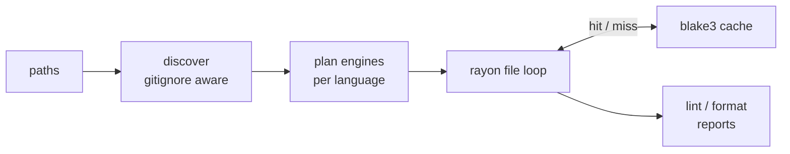

<!-- markdownlint-disable MD033 MD041 -->
<div align="center">


**The polyglot lint and format pipeline for whole repositories.**

Polylint ships the `poly` CLI: one config, one Rust pipeline, curated in-process backends,
tree-sitter fallback for everything else, and repo-wide cache + parallel execution. No language
runtime is required for the default path; `gofmt` and `rustfmt` are used when present, and other
external tools are opt-in.

Lint + format · one `poly.toml` · pure Rust default · blake3 cache · rayon parallelism · hooks +
commit checks · JSON + TOON + MCP

[](https://github.com/Goldziher/polylint/actions/workflows/ci.yaml)
[](https://www.npmjs.com/package/@nhirschfeld/polylint)
[](https://pypi.org/project/polylint/)
[](LICENSE)

[Install](#installation) · [Quickstart](#quickstart) · [What You Get](#what-you-get) ·
[How It Works](#how-it-works) · [Backends](#backend-coverage) · [CLI](#cli-reference)

</div>

---

## Quickstart

```console
$ poly fmt --check
would format crates/example/src/main.rs

$ poly fmt --fix
formatted 1 file

$ poly lint --format toon
path: crates/example/src/main.rs
diagnostics[0]: engine=ruff, code=F401, severity=warning, title="`os` imported but unused"

$ poly hooks install
installed git hooks: pre-commit, commit-msg
```

`poly fmt` is a dry run by default (CI-friendly); add `--fix` to write changes, and `poly lint
--fix` to apply lint autofixes. `poly hooks install` wires the git hooks once — lint, format, and
commit checks then run on every `git commit`.

---

## What You Get

<!-- markdownlint-disable MD013 -->

| Capability | What it does | Main surfaces |
|---|---|---|
| **Repo-wide lint + format** | Discovers files, routes each language to the best available backend, and reports normalized diagnostics and formatting drift. | `poly lint` · `poly fmt` |
| **One config** | `poly.toml` drives linting, formatting, hooks, commit-message policy, cache settings, and optional tool catalog entries. | `[defaults]` · `[lint.*]` · `[fmt.*]` · `[hooks]` · `[tools]` |
| **Curated Rust backends** | Wraps high-quality Rust libraries in-process: oxc, ruff internals, taplo, rumdl, sqruff, malva, markup_fmt, mago, and more. | Backend registry |
| **Generic fallback** | Uses `tree-sitter-language-pack` for identified languages without a dedicated backend, reindenting supported grammars and normalizing whitespace where safe. | `treesitter` tier |
| **Cache + parallelism** | Runs per file with rayon and skips unchanged work with a blake3 content-hash cache keyed by file bytes, engine, version, and resolved config. | `poly cache` · `--no-cache` · `-j` |
| **Git hooks** | Runs first-class builtins and inline hook jobs from `poly.toml`, with file-safety checks and Cargo tools available as builtins. | `poly hooks install` · `poly hooks run` |
| **Commit checks** | Enforces Conventional Commits and strips AI-attribution trailers through the bundled `gitfluff` engine. | `poly commit` |
| **Agent-friendly output** | Emits structured JSON and compact TOON, and exposes lint/format/cache operations over an MCP stdio server. | `--format json` · `--format toon` · `poly mcp` |
| **Optional breadth tier** | Enables tools from the embedded mdsf catalog only when you opt in; commands are PATH-probed and skipped when absent. | `[tools.<name>]` |
| **Simple distribution** | Installs prebuilt release archives containing the `poly` binary, verified by release checksums. | Installer · GitHub Action · Homebrew · npm · PyPI |

<!-- markdownlint-enable MD013 -->

---

## Installation

Polylint is distributed like `ruff` or `biome`: prebuilt release artifacts plus thin installers and
package wrappers. The workspace crates are not published to crates.io.

### Installer Scripts

```sh
curl -fsSL https://raw.githubusercontent.com/Goldziher/polylint/main/install.sh | sh
```

Windows PowerShell:

```powershell
irm https://raw.githubusercontent.com/Goldziher/polylint/main/install.ps1 | iex
```

Both installers detect the platform, download the matching release archive, verify it against
`sha256sums.txt`, and install `poly`. Set `POLY_VERSION=v0.1.0` to pin a version or
`POLY_INSTALL_DIR=/path/to/bin` to choose the destination.

### GitHub Actions

```yaml
- uses: Goldziher/polylint@v0
  with:
    version: latest
```

The action resolves the requested release, caches the installed binary bundle by version and
platform, and adds `poly` to `PATH`.

### Package Managers

```sh
brew install Goldziher/tap/polylint
npm install -g @nhirschfeld/polylint
pip install polylint
cargo binstall --git https://github.com/Goldziher/polylint poly-cli
```

The npm and PyPI packages are thin wrappers that download the verified prebuilt binary bundle for
your platform.

### Manual or Source Builds

Download a release archive from
[GitHub Releases](https://github.com/Goldziher/polylint/releases), or build from source:

```sh
git clone https://github.com/Goldziher/polylint
cd polylint
cargo build --release
```

Source builds place the binary at `target/release/poly`.

---

## How It Works

<details open>
<summary><strong>Pipeline</strong></summary>

`poly` discovers files once, plans engines once per language, prefetches the generic tier's
tree-sitter grammars, and then runs the per-file work in parallel. Each backend returns the same
`Diagnostic` and `FormatOutput` shapes, so reporting, cache behavior, and MCP output stay uniform.



</details>

<details>
<summary><strong>Zero-dependency default</strong></summary>

The default path does not require Python, Node, Go, a JVM, or a project-local toolchain. Most
backends are Rust crates compiled into the binary. Two canonical native formatters are default-on
when present: `gofmt` for Go and `rustfmt` for Rust. If either is missing, the language falls back to
the generic tier. `zig fmt`, `shfmt`, `shellcheck`, and catalog tools are opt-in and are skipped when
absent.

</details>

<details>
<summary><strong>Cache and debug data</strong></summary>

The result cache is keyed by file bytes, engine name, engine `version()`, and resolved engine
configuration. A tool upgrade or config change invalidates stale entries. `--debug` reports per-file
engine timing and cache hit/miss data in pretty output and attaches it to JSON/TOON output.

</details>

---

## Configuration

Polylint discovers the nearest `poly.toml`. `polylint.toml` is still read as a fallback for older
projects, and `poly.local.toml` can layer local overrides over the primary config.

```toml
[defaults]
line_length = 120
line_ending = "lf"
final_newline = true
trim_trailing_whitespace = true

[fmt.python.ruff]
docstring_code_format = true
docstring_code_line_length = 120

[lint.python.ruff]
select = ["E", "F", "W"]

[hooks]
stages = ["pre-commit", "commit-msg"]

[hooks.builtin]
polylint = true
polyfmt = true
commit = { stages = ["commit-msg"] }
file_safety = true
cargo = true
```

### Optional Catalog Tools

Opt into tools from the embedded mdsf catalog only when you want them:

```toml
[tools.prettier]
enabled = true
languages = ["javascript", "typescript"]

[tools.black]
enabled = true
languages = ["python"]
```

Catalog tools are capability-probed on `PATH`; a missing binary is skipped instead of making the
whole run fail.

### Hooks

Install poly's git hooks once — they then run on every `git commit`:

```sh
poly hooks install
```

Hooks come from `poly.toml`: builtins (`polylint`, `polyfmt`, `commit`, `file_safety`, `cargo`)
plus inline jobs. poly never clones or runs foreign pre-commit repositories. Add an inline job:

```toml
[hooks.pre-commit.scripts.docs]
script = "scripts/check-docs.sh"
runner = "bash"
files = "**/*.md"
```

---

## Backend Coverage

Polylint uses a tiered model:

1. Curated Rust backends for high-fidelity lint and format support.
2. Native-toolchain backends for canonical first-party formatters when configured or present.
3. Tree-sitter generic formatting for identified languages without a dedicated backend.
4. Optional catalog tools from the embedded mdsf registry.

<!-- markdownlint-disable MD013 -->

| Language or files | Backend | Lint | Format |
|---|---|---:|---:|
| JavaScript / TypeScript / JSX / TSX | oxc | yes | yes |
| JSON / JSONC | oxc parse diagnostics + formatter | yes | yes |
| Python | ruff internals | yes | yes |
| TOML | taplo | yes | yes |
| Markdown | rumdl | yes | yes |
| SQL | sqruff | yes | yes |
| YAML | saphyr + pretty_yaml | yes | yes |
| CSS / SCSS / Less | malva | no | yes |
| HTML / Vue / Svelte / Astro / Angular / templates / XML | markup_fmt | no | yes |
| GraphQL | graphql-parser + pretty_graphql | yes | yes |
| HCL / Terraform | hcl-edit + hcl-rs, tree-sitter for comment-preserving format fallback | yes | yes |
| Dockerfile | dockerfile-parser hadolint-style rules | yes | no |
| Nix | alejandra | no | yes |
| Ruby | rubyfmt | no | yes |
| PHP | mago | yes | yes |
| R | jarl + air formatter | yes | yes |
| Go | `gofmt` when present, tree-sitter fallback otherwise | no | yes |
| Rust | `rustfmt` when present, tree-sitter fallback otherwise | no | yes |
| Zig | opt-in `zig fmt`, tree-sitter fallback otherwise | no | yes |
| Shell | opt-in `shellcheck` + `shfmt`, tree-sitter fallback otherwise | optional | optional |
| All text files | typos spell-check | yes | no |
| Other identified grammars | tree-sitter generic tier | no | best effort |

<!-- markdownlint-enable MD013 -->

Unsupported or unknown file types are skipped unless `tree-sitter-language-pack` can identify them.
Some whitespace-sensitive data, template, or patch grammars intentionally no-op rather than risk a
destructive rewrite.

---

## CLI Reference

<details>
<summary><strong>lint and format</strong></summary>

```text
poly lint [PATHS]...
poly fmt [PATHS]...

  --fix                        Apply lint fixes or formatting in place.
  --check                      Explicit fmt dry run. This is the default.
  --format <pretty|json|toon>  Output format. Default: pretty.
  --config <PATH>              Use an explicit config file.
  --no-cache                   Bypass the result cache.
  -j, --jobs <N>               Parallel jobs. Default: logical cores.
  --no-color                   Disable colored output.
  --verbose                    Pretty output includes descriptions, URLs, and metadata.
  --debug                      Include cache hit/miss and timing data.
```

Exit codes:

| Code | Meaning |
|---:|---|
| 0 | No issues, no formatting drift, or all writes succeeded |
| 1 | Lint findings remain, or dry-run formatting would change files |
| 2 | Internal error such as config or I/O failure |

</details>

<details>
<summary><strong>commit, hooks, cache, and MCP</strong></summary>

```sh
poly commit "feat: add backend"
poly hooks install
poly cache stats
poly cache size
poly cache gc
poly cache clean
poly mcp --config /path/to/poly.toml
```

The MCP server exposes read-only tools for lint, format checks, and cache stats, plus separate
mutating tools for lint fixes, format writes, and cache cleanup. Every MCP operation returns the same
JSON shape as the corresponding CLI command with `--format json`.

</details>

---

## Workspace Layout

```text
crates/
├── polylint-core/   # Engine trait, registry, discovery, runner, reports
├── poly-config/     # poly.toml schema and config loading
├── poly-cli/        # poly umbrella CLI
├── gitfluff/        # Conventional Commit linter
├── poly-hooks/      # git-hook runner
├── poly-mcp/        # MCP stdio server
├── poly-cache/      # blake3 result cache
├── poly-catalog/    # embedded mdsf tool catalog
└── conformance/     # differential test harness
```

---

## Contributing

Keep changes small and test-backed. New or changed backends should include representative known-bad
and known-unformatted fixtures under `crates/polylint-core/tests/`, and should preserve the uniform
`Engine` boundary. Before committing, run:

```sh
poly hooks install   # wires lint/format/cargo checks into git; they run on every commit
cargo test --workspace
```

---

## License

MIT - see [LICENSE](LICENSE).
