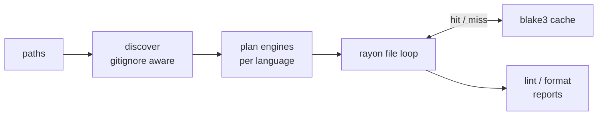

<!-- markdownlint-disable MD033 MD041 -->
<div align="center">


**One binary. ~30 languages. No toolchain to install.**

poly lints and formats whole repositories in seconds: curated Rust backends for the languages
that matter, a tree-sitter fallback for everything else, and a Claude/Codex plugin plus an MCP
server so agents can drive it directly instead of shelling out.

Lint + format · one `poly.toml` · pure Rust, zero deps · blake3 cache + rayon parallelism · git
hooks & commit checks · MCP + Claude/Codex plugin

[](https://github.com/Goldziher/poly/actions/workflows/ci.yaml)
[](LICENSE)
[](https://goldziher.github.io/poly)

[Install](#installation) · [What You Get](#what-you-get) · [What Runs Out of the Box](#what-runs-out-of-the-box) ·
[AI Agents & MCP](#ai-agents--mcp) · [Performance](#performance) ·
[Docs](https://goldziher.github.io/poly) · [Contributing](#contributing)

</div>

---

## What You Get

<!-- markdownlint-disable MD013 -->

| Capability | What it does |
|---|---|
| **Fast on real repos** | Lints Django in 0.82s and home-assistant's 25,000 files in 3.5s, cold cache; see [Performance](#performance). |
| **One binary, no toolchain** | ~30 languages with native Rust backends (ruff, oxc, biome, mago, taplo, rumdl, sqruff, malva, markup_fmt, rubyfmt, …) plus a tree-sitter tier for everything else. No Node, Python, or Ruby needed. |
| **Built for agents** | A Claude/Codex plugin and a stdio MCP server ship in the box — an agent calls poly's tools directly instead of shelling out and parsing text. See [AI Agents & MCP](#ai-agents--mcp). |
| **One config** | `poly.toml` drives linting, formatting, git hooks, and commit-message policy. |
| **Cache + parallelism** | A blake3 content-hash cache skips unchanged work; rayon parallelizes the rest across cores. |
| **Git hooks & commit checks** | `poly hooks install` wires lint, format, and Conventional-Commit checks into git — no external hook framework. |
| **Two lint tiers on every language** | A code-quality metrics engine and a built-in 26-rule ast-grep pack (13 rules on by default) run on top of the backends above, at warning severity so they never redden an unconfigured CI. |
| **Simple distribution** | Prebuilt binaries via a shell/PowerShell installer, a GitHub Action, Homebrew, Scoop, npm, and PyPI. |

<!-- markdownlint-enable MD013 -->

---

## Installation

### Quick install

```sh
curl -fsSL https://raw.githubusercontent.com/Goldziher/poly/main/install.sh | sh
```

Windows PowerShell:

```powershell
irm https://raw.githubusercontent.com/Goldziher/poly/main/install.ps1 | iex
```

Both detect the platform, download the matching release archive, and verify it against
`sha256sums.txt`. Set `POLY_VERSION=0.23.1` to pin an exact release.

### GitHub Actions

```yaml
- uses: Goldziher/poly@v0
  with:
    version: v0.23.1 # omit for the latest release
```

Forwards to `install.sh` and caches the installed binary by version and platform. See
[`ACTION_USAGE.md`](ACTION_USAGE.md) for the full input/output reference.

### Package managers

```sh
brew install Goldziher/tap/poly
```

```powershell
scoop bucket add goldziher https://github.com/Goldziher/scoop-bucket
scoop install poly
```

Homebrew's tap is a single rolling formula with no versioned alias yet — treat it as a
get-latest channel and use the installer script or the GitHub Action where a pinned version
matters. `cargo binstall --git https://github.com/Goldziher/poly poly-cli` also works, resolving
the same GitHub release archives.

### npm and PyPI

```sh
npm i -g @goldziher/polylint
pip install polylint
```

Both install the same prebuilt `poly` binary. The package is named `polylint` (the unscoped
`poly` name belongs to unrelated projects on both registries), but **the executable is `poly`
on every channel** — `polylint` also works everywhere as an alias for the same binary. Full
per-platform detail in [docs/INSTALL-PACKAGES.md](docs/INSTALL-PACKAGES.md).

### As an agent plugin

poly ships its own Claude/Codex plugin, registering `poly mcp` as a stdio server plus 5 skills
and 2 slash commands (`/poly-check`, `/poly-fix`):

```text
/plugin marketplace add Goldziher/poly
/plugin install poly@poly
```

Codex: add the `Goldziher/poly` marketplace through your client's plugin manager (manifest at
`.codex-plugin/plugin.json`). The plugin assumes `poly` is already on `PATH` — it does not
bundle the binary — and its version tracks the `poly` binary version lock-step. See
[AI Agents & MCP](#ai-agents--mcp).

### As an MCP server

Any MCP-capable client can run poly directly:

```json
{
  "mcpServers": {
    "poly": { "command": "poly", "args": ["mcp"] }
  }
}
```

---

## Quickstart

```console
$ poly lint
./app.py
  warning  ruff  T201  5:5  `print` found
  warning  ruff  ANN201  4:5  Missing return type annotation for public function `main`
  error  ruff  F401  1:8  `os` imported but unused

3 issues found.
  2 files linted
  1 issue fixable with the `--fix` option

$ poly fmt --check
would reformat ./src/main.rs

1 file will change.
  2 files checked

$ poly fmt --fix
reformatted ./src/main.rs

1 file reformatted.
  2 files checked

$ poly hooks install
✓ Installed 2 git hooks in .git/hooks
  › commit-msg
  › pre-commit
```

`poly fmt` is a dry run by default (CI-friendly); add `--fix` to write changes, and `poly lint
--fix` to apply lint autofixes. `poly hooks install` wires the git hooks once — lint, format, and
commit checks then run on every `git commit`.

Exit codes are a contract: `0` is clean, `2` means the run verified less than it claims, and `1`
means findings — which for `poly fmt --fix` reports *that files were rewritten*, so a script
running it in fix mode should treat `1` as success. Add `-q` to trim the per-file detail on a
large repository; the summary keeps every count and reason.

---

## Demos

Real recordings, not mockups — `vhs` runs each command live, so the timings on screen are the
timings you get. Tapes are in [`docs/media/tapes/`](docs/media/tapes/).

**Kubernetes: 31,303 files, one binary, no Go toolchain.**


**Django is not a Python repo** — it is Python, JavaScript, CSS, HTML, TOML, YAML and Markdown.
One tool, one config, one pass.


**Every report has a machine-readable form.** `--format toon` is compact enough to hand to an
agent without burning its context; `--format json` is there when you want a document to parse.


**And an agent can skip the terminal entirely.** `poly mcp` speaks MCP over stdio and advertises
the same eleven tools the CLI exposes.


---

## How It Works

poly discovers files once (respecting `.gitignore`), plans the engine list once per language, and runs the per-file
work in parallel on a rayon pool. Every backend — a linked-in Rust crate, the tree-sitter tier, or a wrapped CLI —
returns the same `Diagnostic` and `FormatOutput` shapes, so reporting, caching, and MCP output stay uniform.


```mermaid
flowchart LR
  A["paths"]
  B["discover<br/>gitignore aware"]
  C["plan engines<br/>per language"]
  D["rayon file loop"]
  E["blake3 cache"]
  F["lint / format<br/>reports"]
  A --> B --> C --> D
  D <-->|hit / miss| E
  D --> F
```

The default path needs no Python, Node, Go, or JVM — the backends are Rust crates compiled into the binary, and a
language without a dedicated backend falls through to a tree-sitter generic tier that is still pure Rust. The result
cache is keyed by file bytes, engine name, engine version, and resolved engine config, so a tool upgrade or a config
change invalidates exactly the entries it affects. `--debug` prints per-file engine timing and cache hit/miss data.

---

## What Runs Out of the Box

poly is useful with an empty `poly.toml`. This is what a run with no configuration actually does; anything opt-in is
marked as such.

<!-- markdownlint-disable MD013 -->

| Backend | What it enables by default |
|---|---|
| **ruff** (Python) | 22 selector groups: ruff's own `F`, `E4`, `E7`, `E9`, plus `W6`, `I`, `UP`, `B`, `ANN`, `SIM`, `C4`, `RET`, `FURB`, `PERF`, `TRY`, `BLE`, `S110`, `C90`, `PLR`, `T20`, `TC`, `PTH`, `RUF`, `ARG`. `E1`/`E2`/`E3`/`W1`/`W2`/`W3` stay off because the formatter owns them, and seven noisy members are turned back off: `B008`, `RUF100`, `ANN002`, `ANN003`, `ARG002`, `PLR2004`, `TRY003`. Line length 120, docstring code formatted at width 120. |
| **oxlint** (JS/TS) | oxlint's own default is `correctness` only. poly adds `suspicious`, `pedantic`, `complexity`, `typescript/no-explicit-any`, `typescript/no-non-null-assertion` and `no-console`, all at warning. `restriction`, `style` and `nursery` stay off; `no-underscore-dangle`, `max-lines-per-function`, `max-lines` and `max-classes-per-file` are turned back off. |
| **mago** (PHP) | PHP 8.4, with six maintainability metrics downgraded from error to warning: `cyclomatic-complexity` (15), `excessive-parameter-list` (5), `too-many-methods` (10), `too-many-properties` (10), `too-many-enum-cases` (20), `kan-defect` (1). |
| **rumdl** (Markdown) | Five rumdl-proprietary stylistic rules disabled, plus four more for MDX. Line length 120. |
| **biome** (CSS/SCSS, GraphQL) | The `correctness` and `suspicious` rule groups. Accessibility, style, complexity, performance and security are opt-in. |

<!-- markdownlint-enable MD013 -->

### Three tiers that run on every language

- **`typos`** — spell-checks identifiers, comments and strings. Always on; it has no enable key.
- **The code-quality engine** — tree-sitter metric rules, listed below.
- **The built-in ast-grep pack** — 26 rules across C#, Elixir, Go, Java, Kotlin, Python, Ruby, Rust and Swift. **13
  are on by default**; the other 13 ship `severity: off` and are one config line away. Your own rules under
  `[rules] dirs` sit above the pack — a rule with the same `id` replaces the built-in one outright.

A fourth cross-cutting engine, `uncomment` (comment removal), is off by default.

| Quality rule | Default |
|---|---|
| `file-too-long` | 1000 lines |
| `function-too-long` | 80 lines |
| `type-too-long` | 300 lines |
| `too-many-parameters` | 6 |
| `nesting-too-deep` | 4 |
| `cyclomatic-complexity` | 20 |
| `lazy-ignore` | on |
| `magic-number` | opt-in — allows −1, 0, 1, 2, 10, 100 |
| `law-of-demeter` | opt-in — chain depth 3 |

The quality engine never duplicates a backend rule: where ruff or oxlint already covers a metric, it defers. It counts
as lint *coverage* only for languages whose control flow it can model — Python, Rust, Go, JavaScript, JSX, TypeScript,
TSX, Java, Kotlin, C, C++, C# and Ruby — while other languages still get the line-count rules.

Everything these three tiers report is **warning** severity, and warnings alone do not fail a run, so turning poly on
does not redden an unconfigured CI.

### Native toolchain CLIs

`gofmt`, `rustfmt` and `shellcheck` run automatically when found on `PATH`; `shellcheck` is the only one of the three
that lints. `zig fmt`, `shfmt`, `google-java-format`, `ktfmt`, `styler` (R), `swift-format`, `dart format` and
`gleam format` are opt-in. When a tool is absent the language falls through to the tree-sitter tier, so the
zero-dependency promise holds either way.

---

## Backend Coverage

<!-- markdownlint-disable MD013 -->

| Language | Backend | Lint | Format |
|---|---|---:|---:|
| Python | ruff | yes | yes |
| JavaScript / TypeScript / JSX / TSX / JSON | oxc | yes | yes |
| TOML | taplo | yes | yes |
| YAML | saphyr + pretty_yaml | yes | yes |
| Markdown / MDX | rumdl | yes | yes |
| SQL | sqruff | yes | yes |
| CSS / SCSS | malva + biome | yes | yes |
| Less | malva | no | yes |
| GraphQL | graphql + biome | yes | yes |
| PHP | mago | yes | yes |
| HCL / Terraform | hcl | yes | yes |
| HTML / Vue / Svelte / Astro / XML | markup_fmt | no | yes |
| Dockerfile | dockerfile | yes | no |
| `.env` | dotenv | yes | no |
| INI | ini | yes | no |
| Ruby | rubyfmt | no | yes |
| Nix | alejandra | no | yes |
| Go | `gofmt`, automatic when installed | no | yes |
| Rust | `rustfmt`, automatic when installed | no | yes |
| Shell | `shellcheck` automatic, `shfmt` opt-in | yes | opt-in |
| Zig / Java / Kotlin / R / Swift / Dart / Gleam | first-party CLI, opt-in | no | opt-in |
| Everything else identified | tree-sitter generic tier | no | best effort |

<!-- markdownlint-enable MD013 -->

The `Lint` column is the language's own backend; the three cross-cutting tiers add findings on top, including where
that column says `no`. Beyond this table, an opt-in catalog of 348 tools across 175 languages covers the long tail.
Full per-language reference: [Backends](https://goldziher.github.io/poly/reference/backends/).

---

## AI Agents & MCP

poly ships its agent integration in the box rather than expecting one to be bolted on.

```text
/plugin marketplace add Goldziher/poly
/plugin install poly@poly
```

That installs 5 skills and 2 slash commands (`/poly-check`, `/poly-fix`) that teach an agent poly's tiered backend
model and when to reach for lint vs. format vs. hooks. Codex clients add the same marketplace through their own
plugin manager.

`poly mcp` is a stdio MCP server exposing eleven tools that mirror the CLI 1:1 — `lint`, `format_check`, `rules`,
`config_show`, `cache_stats` and `version` (read-only), `lint_fix`, `format_write` and `cache_clean` (mutating), and
`workspace_lint` / `workspace_lint_fix`. The last two run the multi-minute whole-project phase (`cargo clippy`,
`cargo-sort`, `cargo-machete`, `cargo-deny`) and are exposed as async **Tasks**: the call returns a handle the client
polls with `tasks/get`, falling back to a synchronous result for clients that do not declare the capability.

Every result carries a `poly` identity block (version, build id, channel, executable, pid) and separates three
per-file outcomes — **checked**, **skipped** (poly declined the file) and **errored** (poly failed on a file it
accepted). `isError` is set whenever anything errored, so an agent can gate on it before trusting the payload.

Full parameter reference: [`.ai-rulez/skills/poly-mcp/SKILL.md`](.ai-rulez/skills/poly-mcp/SKILL.md).

---

## Performance

Release build, Apple Silicon, cold cache (`--no-cache`), best of three runs on an idle machine.
`poly lint --no-workspace` and `poly fmt --check` over the whole repository, counting the files
poly actually inspected. These are poly's own numbers — **not** a comparison against ruff,
oxlint, biome or anything else; no such benchmark was run.

<!-- markdownlint-disable MD013 -->

| Project | `poly lint` | Findings | Peak RSS | `poly fmt --check` |
|---|---|---|---|---|
| Django | 3,113 files in **0.82s** | 66,839 | 0.21 GB | 5,539 files in 0.30s |
| home-assistant | 25,443 files in **3.5s** | 376,829 | 0.48 GB | 25,559 files in 1.2s |
| Kubernetes | 21,657 files in **6.8s** | 41,576 | 0.40 GB | 21,824 files in 12.9s |
| prettier | 7,057 files in **1.9s** | 19,373 | 0.40 GB | 7,450 files in 0.44s |
| TypeScript | 32,606 files in **13.3s** | 179,586 | 0.52 GB | 40,012 files in 4.0s |

<!-- markdownlint-enable MD013 -->

Kubernetes is the one repository where formatting costs more than linting: its Go files go
through `gofmt`, the one backend that is a subprocess rather than a linked-in crate, and ~20,000
process spawns dominate the run.

The blake3 cache and rayon parallelism (see [How It Works](#how-it-works)) are what keep repeat
runs fast — Django re-lints in 0.71s warm against 0.82s cold: a cache hit skips the engine
entirely, and everything else is split across cores.

---

## Documentation

A single `poly.toml` drives linting, formatting, git hooks, and commit-message policy; `poly.local.toml` layers local
overrides on top, nested files cascade in a monorepo, and `poly config show` prints the effective merged result.
Unknown keys, unknown sections and wrongly-typed values are reported as warnings, never silently ignored.

- [Quickstart](https://goldziher.github.io/poly/start/quickstart/) — install, first run, first config.
- [Configuration](https://goldziher.github.io/poly/guides/configuration/) — every key, rule selection, inline
  suppression, monorepo cascading, shared and remote config.
- [Hooks](https://goldziher.github.io/poly/guides/hooks/) — `poly hooks install`, builtin hooks, staged isolation,
  timeouts, concurrency, caching.
- [CLI reference](https://goldziher.github.io/poly/reference/cli/) — every subcommand and flag, and the exit-code
  contract.
- [Backends](https://goldziher.github.io/poly/reference/backends/) — full language table and the tool catalog.

---

## Contributing

Keep changes small and test-backed. A new or changed backend needs known-bad and known-unformatted fixtures under
`crates/poly-core/tests/`, and must preserve the uniform `Engine` boundary. Before committing:

```sh
poly hooks install   # wires lint/format/cargo checks into git; they run on every commit
cargo test --workspace --no-fail-fast
```

For anything touching the runner, an engine, or the rule pack, also run the hardening harness. poly's
own fixtures are small and chosen to exercise a known path; the harness runs poly over real
third-party trees and checks the things fixtures cannot — that no file errored, that formatting
converges in two passes, that the cache never serves a different answer than a cold run, and that no
language poly claims to lint reports `no lint rules for` it:

```sh
task harden          # pinned third-party repositories
task harden:local    # the sibling working trees next door, read-only
```

It also reports per-rule finding counts per repository, which is how a pack rule earns a default
severity. See [`docs/harden-corpus.md`](docs/harden-corpus.md) for what each corpus is allowed to
assert, and why a count needs a pinned input while an invariant does not.

---

## License

MIT - see [LICENSE](LICENSE).
