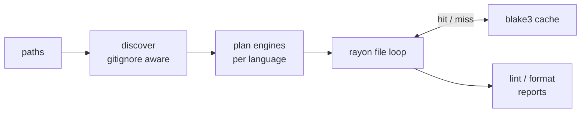

<!-- markdownlint-disable MD033 MD041 -->
<div align="center">


**The polyglot lint and format pipeline for whole repositories.**

**poly** is a single CLI: one config, one Rust pipeline, curated in-process backends,
tree-sitter fallback for everything else, and repo-wide cache + parallel execution. No language
runtime is required for the default path; `gofmt` and `rustfmt` are used when present, and other
external tools are opt-in.

Lint + format · one `poly.toml` · pure Rust default · blake3 cache · rayon parallelism · hooks +
commit checks · JSON + TOON + MCP

[](https://github.com/Goldziher/poly/actions/workflows/ci.yaml)
[](LICENSE)

[Install](#installation) · [Quickstart](#quickstart) · [What You Get](#what-you-get) ·
[How It Works](#how-it-works) · [Backends](#backend-coverage) · [CLI](#cli-reference)

</div>

---

## Quickstart

```console
$ poly fmt --check
would reformat crates/example/src/main.rs

1 file(s) will change of 1 file(s)

$ poly fmt --fix
reformatted crates/example/src/main.rs

1 changed of 1 file(s)

$ poly lint --format toon
path: crates/example/src/main.rs
diagnostics[0]: engine=ruff, code=F401, severity=warning, title="`os` imported but unused"

$ poly hooks install
✓ Installed 10 git hooks in .git/hooks
  › commit-msg
  › pre-commit
  › pre-push
  …
```

`poly fmt` is a dry run by default (CI-friendly); add `--fix` to write changes, and `poly lint
--fix` to apply lint autofixes. `poly hooks install` wires the git hooks once — lint, format, and
commit checks then run on every `git commit`.

---

## What You Get

<!-- markdownlint-disable MD013 -->

| Capability | What it does | Main surfaces |
|---|---|---|
| **Repo-wide lint + format** | Discovers files, routes each language to the best available backend, and reports normalized diagnostics and formatting drift. | `poly lint` · `poly fmt` |
| **One config** | `poly.toml` drives linting, formatting, hooks, commit-message policy, cache settings, and optional tool catalog entries. | `[defaults]` · `[lint.*]` · `[fmt.*]` · `[hooks]` · `[tools]` |
| **Curated Rust backends** | Wraps high-quality Rust libraries in-process: oxc, ruff internals, taplo, rumdl, sqruff, malva, markup_fmt, mago, and more. | Backend registry |
| **Generic fallback** | Uses `tree-sitter-language-pack` for identified languages without a dedicated backend, reindenting supported grammars and normalizing whitespace where safe. | `treesitter` tier |
| **Cache + parallelism** | Runs per file with rayon and skips unchanged work with a blake3 content-hash cache keyed by file bytes, engine, version, resolved config, and the identity of the poly build itself. | `poly cache` · `--no-cache` · `-j` |
| **Git hooks** | Runs first-class builtins and inline hook jobs from `poly.toml`, with file-safety checks and Cargo tools as builtins. Whole-workspace hooks (`cargo`, type checkers) run isolated against staged content and skip when their inputs are unchanged. | `poly hooks install` · `poly hooks run` · `workspace` · `isolate` |
| **Commit checks** | Enforces Conventional Commits and strips AI-attribution trailers through the bundled `gitfluff` engine. | `poly commit` |
| **Agent-friendly output** | Emits structured JSON and compact TOON, and exposes lint/format/cache operations over an MCP stdio server. | `--format json` · `--format toon` · `poly mcp` |
| **Optional breadth tier** | Enables tools from the embedded mdsf catalog only when you opt in; commands are PATH-probed and skipped when absent. | `[tools.<name>]` |
| **Simple distribution** | Installs prebuilt release archives containing the `poly` binary, verified by release checksums. | Installer · GitHub Action · Homebrew |

<!-- markdownlint-enable MD013 -->

---

## Installation

poly is distributed like `ruff` or `biome`: prebuilt release artifacts plus a thin installer and a
Homebrew tap. The workspace crates are not published to crates.io.

### Installer Scripts

```sh
curl -fsSL https://raw.githubusercontent.com/Goldziher/poly/main/install.sh | sh
```

Windows PowerShell:

```powershell
irm https://raw.githubusercontent.com/Goldziher/poly/main/install.ps1 | iex
```

Both installers detect the platform, download the matching release archive, verify it against
`sha256sums.txt`, and install `poly`. Set `POLY_VERSION=v0.5.0` to pin a version or
`POLY_INSTALL_DIR=/path/to/bin` to choose the destination. This is a **true pin**: the installer
downloads that exact tag's release archive and refuses to install it unless it matches the
checksum published for that release — it never falls back to "already have some `poly`, skip".

Re-run either installer to upgrade. Upgrades are **atomic**: the new binary is staged beside the
destination and renamed over it, so `poly` is never momentarily missing or half-written. That
matters because `poly hooks install` wires git hooks that resolve `poly` from `PATH` globally and
**fail closed** — an upgrade that deletes or truncates the destination first blocks every commit in
every repository on the machine until it finishes. If you install poly some other way, do the same
(write `poly.tmp`, `chmod`, then `mv` it over the target; `cargo install` already works this way)
rather than removing or overwriting the binary in place.

### GitHub Actions

```yaml
# Pin a version (recommended for CI reproducibility):
- uses: Goldziher/poly@v0
  with:
    version: v0.20.0

# Latest release, cached (default when `version` is omitted):
- uses: Goldziher/poly@v0
```

The action forwards `version:` verbatim to `install.sh`, so it is the **same true pin** as the
installer scripts above — an exact release, checksum-verified, not a presence check. It caches the
installed binary bundle by resolved version and platform, and adds `poly` to `PATH`. See
[`ACTION_USAGE.md`](ACTION_USAGE.md) for the full input/output reference, including how to also
pin the action's own code to a commit SHA independent of the `version:` input.

### Package Managers

```sh
brew install Goldziher/tap/poly
cargo binstall --git https://github.com/Goldziher/poly poly-cli
```

`cargo binstall`'s `[package.metadata.binstall]` (`crates/poly-cli/Cargo.toml`) resolves against
the same GitHub release archives as the installer scripts, so `--version 0.20.0` (or
`poly-cli@0.20.0`) is also a true pin — it does not require a crates.io publish.

**Homebrew cannot pin today.** `Goldziher/tap/poly` is a single formula that the release
pipeline rewrites in place on every release — there is no versioned alias (e.g. `poly@0.19`) to
request an older release by name, so `brew install`/`brew upgrade` always resolve to whatever is
currently at `HEAD` of the tap. Treat Homebrew as a get-latest channel and verify what you got
after the fact (below); use the installer scripts, the GitHub Action, or `cargo binstall`, all of
which support a true pin, wherever reproducibility matters.

### Pinning poly in a repository

Lint and format output depends on the poly version, so a repository that does not pin one can see
its results change underneath it. **Do not gate installation on poly merely being present:**

```sh
# Wrong: satisfied by ANY poly from ANY channel, so it never upgrades and drifts silently.
command -v poly >/dev/null 2>&1 || brew install Goldziher/tap/poly
```

That check passes as soon as *some* `poly` exists, so the install never runs again and the version
drifts with no signal. It also cannot see a `poly` from another channel shadowing the one it thinks
it installed — `~/.cargo/bin` precedes `/opt/homebrew/bin` on a default macOS `PATH`, so a stray
`cargo`-installed binary wins silently.

**Prefer a true pin:** the installer scripts (`POLY_VERSION=0.20.0 curl ... | sh`) or the GitHub
Action (`version: v0.20.0`) install exactly the requested, checksum-verified release — no
verify-after-the-fact needed, because there is nothing to drift.

If Homebrew is the only option available (e.g. an interactive dev machine already standardized on
`brew`), pin a version and verify the *resolved* binary instead, since brew itself cannot request
a specific version:

```sh
POLY_VERSION=0.20.0

resolved=$(poly --version 2>/dev/null | awk '{print $2}' || true)
if [ "$resolved" != "$POLY_VERSION" ]; then
  brew upgrade Goldziher/tap/poly || brew install Goldziher/tap/poly
  resolved=$(poly --version 2>/dev/null | awk '{print $2}' || true)
fi
[ "$resolved" = "$POLY_VERSION" ] || {
  echo "poly $POLY_VERSION required, but $(command -v poly) reports ${resolved:-none}" >&2
  exit 1
}
```

Three details matter: `brew install` no-ops on an already-installed-but-outdated formula (hence
`brew upgrade ||`), the version is re-checked *after* installing rather than assumed, and the
failure message names `command -v poly` so a shadowed binary is identifiable rather than baffling.
Note this still only *verifies* the version post-install — it cannot request `0.20.0` specifically
if `brew upgrade` has already moved past it; see "Package Managers" above.

In CI, prefer the GitHub Action or the installer script with an explicit version — both resolve
and install a specific release rather than whatever is already on the runner.

### Manual or Source Builds

Download a release archive from
[GitHub Releases](https://github.com/Goldziher/poly/releases), or build from source:

```sh
git clone https://github.com/Goldziher/poly
cd poly
cargo build --release
```

Source builds place the binary at `target/release/poly`.

### Install as a Plugin

poly ships its own Claude/Codex plugin, registering `poly mcp` as a stdio MCP server plus
5 skills and 2 slash commands that teach an agent to use poly as its lint/format
orchestrator. The plugin assumes `poly` is already on `PATH` (installer, Homebrew, or a
source build above) — it does not bundle the binary.

Claude Code:

```text
/plugin marketplace add Goldziher/poly
/plugin install poly@poly
```

Codex: add the `Goldziher/poly` marketplace through your Codex client's plugin manager and
install the `poly` plugin from it — the manifest lives at `.codex-plugin/plugin.json`.

The plugin version is lock-step with the `poly` binary version (`poly --version` and the
installed plugin version always match).

---

## How It Works

<details open>
<summary><strong>Pipeline</strong></summary>

`poly` discovers files once, plans engines once per language, prefetches the generic tier's
tree-sitter grammars, and then runs the per-file work in parallel. Each backend returns the same
`Diagnostic` and `FormatOutput` shapes, so reporting, cache behavior, and MCP output stay uniform.


```mermaid
flowchart LR
  A["paths"]
  B["discover<br/>gitignore aware"]
  C["plan engines<br/>per language"]
  D["rayon file loop"]
  E["blake3 cache"]
  F["lint / format<br/>reports"]
  A --> B --> C --> D
  D <-->|hit / miss| E
  D --> F
```

</details>

<details>
<summary><strong>Zero-dependency default</strong></summary>

The default path does not require Python, Node, Go, a JVM, or a project-local toolchain. Most
backends are Rust crates compiled into the binary. Two canonical native formatters are default-on
when present: `gofmt` for Go and `rustfmt` for Rust. If either is missing, the language falls back to
the generic tier. `zig fmt`, `shfmt`, `shellcheck`, and catalog tools are opt-in and are skipped when
absent.

</details>

<details>
<summary><strong>Cache and debug data</strong></summary>

The result cache is keyed by file bytes, engine name, engine `version()`, and resolved engine
configuration. A tool upgrade or config change invalidates stale entries. `--debug` reports per-file
engine timing and cache hit/miss data in pretty output and attaches it to JSON/TOON output.

</details>

---

## Configuration

poly discovers the nearest `poly.toml`, and `poly.local.toml` can layer local overrides over the
primary config. In a monorepo, nested `poly.toml` files cascade — see
[Nested config in a monorepo](#nested-config-in-a-monorepo).

```toml
[defaults]
line_length = 120
line_ending = "lf"
final_newline = true
trim_trailing_whitespace = true

[discovery]
# Gitignore-style globs pruned from the file walk on every direct
# `poly lint` / `poly fmt` run (the CI and GitHub Action path), on top of
# `.gitignore` and the built-in vendored/generated prune set. The file-scoped
# `[hooks.builtin]` hooks (`lint`, `fmt`, `file_safety`) inherit these globs, so
# a repo states its excluded paths once.
exclude = ["test_apps/**", "docs/snippets/**", "artifacts/**"]

# Off by default: naming a file on the command line checks it regardless of
# `exclude`. Turn this on so `exclude` also applies to explicitly named paths,
# not just the directory walk. Equivalent to `--force-exclude`; a hook always
# passes that flag, since it is handed staged paths rather than deliberate ones.
force_exclude = false

[fmt.python.ruff]
docstring_code_format = true
docstring_code_line_length = 120

[lint.python.ruff]
select = ["E", "F", "W"]

# All tools support uniform `select`/`ignore` for rule filtering (rule codes or
# category names). Some backends (mago, R) support per-rule overrides under
# `[lint.<lang>.<tool>.rules.<id>]` for backend-specific configuration.
[lint.php.mago]
select = ["correctness", "security"]   # categories or rule codes
ignore = ["no-else-clause"]
php_version = "8.2"

[lint.php.mago.rules.cyclomatic-complexity]
level = "warning"   # error | warning | info | hint (mago, R only)
threshold = 20

# Suppress specific rules per path glob (lint-only), across every backend.
[per-file-ignores]
"tests/**" = ["F401"]
"**/*.generated.php" = ["correctness"]

[hooks]
stages = ["pre-commit", "commit-msg"]

[hooks.builtin]
lint = true
fmt = true
commit = { stages = ["commit-msg"] }
file_safety = true
cargo = true
```

### Nested config in a monorepo

Run `poly` from a monorepo root and each sub-project's `poly.toml` cascades over the root, the
way ruff and eslint resolve config (see [ADR 0018](adrs/0018-hierarchical-configuration.md)). A
nested config declares **only the diff** — it inherits `[defaults]`, the `[lint.*]`/`[fmt.*]` rule
tables, and `[per-file-ignores]` from its ancestors, up to the workspace root:

```toml
# repo/poly.toml — the workspace root
[workspace]
root = true            # stops the upward cascade here (a repo's `.git` dir is
                       # an implicit boundary too, so this is optional in a repo)

[defaults]
line_length = 120

[lint.python.ruff]
select = ["E", "F", "W"]
```

```toml
# repo/frontend/poly.toml — governs repo/frontend/** only
[defaults]
line_length = 100      # overrides the root; ruff select is inherited

[per-file-ignores]
"*.spec.ts" = ["no-console"]   # glob is relative to repo/frontend/
```

Resolution rules:

- **Rules and defaults cascade** (root → child, deep-merged; the nearest config wins).
- **`[discovery] exclude` globs are additive** across the tree — each config's excludes prune its
  own subtree, so a parent exclude already covers its children.
- **`[per-file-ignores]` globs are relative** to the directory of the config that declares them.
- `--config <path>` pins one config for the whole run and bypasses nested resolution.

### Sharing configuration

A top-level `extends` list inherits any section of `poly.toml` — `[defaults]`,
`[lint.*]`/`[fmt.*]`, `[tools.*]`, `[per-file-ignores]`, `[hooks.*]`, and so on — from local
or pinned remote base configs, so an org can maintain one baseline instead of copy-pasting
it into every repo (see [ADR 0020](adrs/0020-shared-remote-configuration.md)). Entries use
the same `path`/`git`/`revision` vocabulary as `[[hooks.sources]]`:

```toml
extends = [
  { git = "https://github.com/acme/poly-baseline", revision = "<40-hex-oid>", file = "poly.toml" },
  "./poly.overrides.toml",   # later entry = higher precedence
]
```

Bases are deep-merged underneath this file, in listed order; this `poly.toml` and then
`poly.local.toml` always win on top.

**`exclude` lists accumulate; every other key replaces.** A repo that adds one glob of its own
keeps every glob it inherited — and keeps receiving later changes to the base — instead of having
to restate the base's list and freeze a copy of it:

```toml
# base: [discovery] exclude = ["vendor/**", "target/**"]
extends = ["../baseline/poly.toml"]

[discovery]
exclude = ["generated/**"]   # effective: vendor/**, target/**, generated/**
```

To drop what you inherited and state the whole list yourself, add `exclude_mode = "replace"` next
to the `exclude` in that table. The same rule governs `[discovery] exclude` → `[hooks.builtin.*]`
inheritance, and it applies to `exclude` only — rule selections, `[rules] dirs`, `clippy_args` and
every other array still replace.

A `git` base pinned to a full commit OID needs no lock;
a branch or tag ref requires running `poly config update` first, which resolves it into
`poly-config.lock` and prints the `[hooks]`/`[tools]` the base introduces. `extends` is
forbidden in `poly.local.toml`. Extending a remote base means trusting that repository to
run code on your machine — treat it like any other dependency.

### Optional Catalog Tools

Opt into tools from the embedded mdsf catalog only when you want them:

```toml
[tools.prettier]
enabled = true
languages = ["javascript", "typescript"]

[tools.black]
enabled = true
languages = ["python"]
```

Catalog tools are capability-probed on `PATH`; a missing binary is skipped instead of making the
whole run fail.

### Custom Rules

Write your own lint rules — and codemods — as [ast-grep](https://ast-grep.github.io) YAML,
in any of the 300+ languages poly can parse. Custom rules run in-process alongside the native
backends on every `poly lint`, and `poly lint --fix` applies any `fix:` rewrites they declare.
No plugin, no fork, no extra toolchain: rules run on the same tree-sitter grammars poly already
bundles.

Point `[rules] dirs` at one or more directories of rule files (paths are resolved relative to the
`poly.toml` that declares them, so a rule set works from any working directory):

```toml
[rules]
dirs = [".poly/rules"]   # default; set to [] to disable custom rules
```

Each rule is a standard ast-grep YAML document. The `language:` field names a tree-sitter
grammar; any metavariable used in `fix:` must be bound by the `rule:` pattern:

```yaml
# .poly/rules/python/use-is-none.yml
id: use-is-none
language: python
severity: warning
message: Use `is None` rather than `== None`.
rule:
  pattern: $X == None
fix: $X is None
```

For languages where a bare fragment is not valid at file top level (e.g. Go), use ast-grep's
`context`/`selector` pattern form.

#### Testing rules

A rule may ship a companion `<name>-test.yml` holding `valid` snippets (must **not** match) and
`invalid` snippets (must match). An `invalid` entry can also assert the rule's **autofix output**
by giving `code` + `fixed` instead of a bare string:

```yaml
# .poly/rules/python/use-is-none-test.yml
id: use-is-none
valid:
  - x is None
invalid:
  - x == None                 # must match; fix output unchecked
  - code: result == None      # must match AND autofix to `result is None`
    fixed: result is None
```

Run the checks with `poly rules test` (exits non-zero on any failed snippet), and list the
discovered rules with `poly rules list`. Both default to the configured `[rules] dirs`, or accept
explicit directories as arguments.

### Comment Removal (opt-in)

The `uncomment` backend strips comments across every language it recognizes, guided by
tree-sitter and a set of preservation rules (shebangs, `~keep`, TODO/FIXME, documentation, and
your own patterns). It is a **lint** backend: `poly lint` reports each removable comment as a
warning (which never fails CI), and `poly lint --fix` removes them.

It is **off by default**. Enable it, and tune what it keeps, with a language-agnostic
`[lint.uncomment]` block plus optional per-language overrides:

```toml
[lint.uncomment]
enabled = true              # required — the backend is opt-in
remove_todos = false        # keep TODO comments (default)
remove_fixme = false        # keep FIXME comments (default)
remove_docs = false         # keep documentation comments / docstrings (default)
use_default_ignores = true  # keep the built-in directive allow-list (default)
preserve_patterns = ["HACK", "NOTE"]  # keep comments containing these substrings

# Per-language override: strip Python docstrings but keep them elsewhere.
[lint.python.uncomment]
remove_docs = true
```

Per-language booleans override the global value; `preserve_patterns` are unioned with the global
list. A language `uncomment` does not recognize is simply left untouched.

### Hooks

Install poly's git hooks once — they then run on every `git commit`:

```sh
poly hooks install
```

Hooks come from `poly.toml`: builtins, inline jobs, and optional local or Git producer catalogs.
Git refs are resolved into `poly-hooks.lock`; normal runs stay on the locked commit and
`poly hooks update` refreshes configured branches or tags.

Git catalogs share a global cache under `$XDG_CACHE_HOME/poly/hook-sources` (or the
platform cache directory). Poly keeps one URL-keyed bare mirror and immutable checkouts
keyed by commit. A per-source lock serializes fetch and materialization, so different
repositories can safely use the same catalog concurrently without duplicate clones.
Catalog hooks always execute from the consumer repository; the read-only producer checkout is
available through `POLY_HOOK_SOURCE_ROOT`. Local path sources bypass the global cache.

```toml
[[hooks.sources]]
id = "ai-rulez"
git = "https://github.com/acme/poly-hooks.git"
revision = "v4.9.0"
hooks = ["ai-rulez-validate"]

[[hooks.sources]]
id = "ai-rulez-dev"
path = "../ai-rulez"
hooks = ["ai-rulez-validate"]
```

Exactly one of `git` or `path` is required. Git sources require a revision and a committed lock;
local sources accept relative, parent-relative, or absolute paths, remain unlocked, and reload on
every run. The `hooks` list explicitly selects producer hook IDs, so new producer hooks never become
active without a consumer configuration change.

The producer alone owns `poly-hooks.toml`. It can publish multiple hooks and multiple guarded
execution paths for each hook:

```toml
version = 1

[[hooks]]
id = "ai-rulez-validate"
stages = ["pre-commit"]
args = ["generate", "--dry-run"]
files = [".ai-rulez/**", "**/.ai-rulez/**"]
workspace = true
pass_filenames = false

[[hooks.paths]]
channel = "npx"
check = "command -v npx"
run = "npx -y ai-rulez@latest"

[[hooks.paths]]
channel = "uvx"
check = "command -v uvx"
install = "uv tool install ai-rulez"
run = "uvx ai-rulez"
```

Every hook requires at least one path. Poly checks paths in the machine preference order and uses
the first whose `check` exits zero. An optional `install` command runs only during explicit
`poly hooks install`; ordinary hook runs use `run` directly, allowing commands such as `npx -y` or
`uvx` to self-provision. Poly does not fall through if installation or the selected command fails.
Machine-only preferences belong in gitignored `poly.local.toml`:

```toml
[hook_preferences]
channels = ["npx", "uvx", "system"]
```

`poly hooks install` validates every selected hook path before installing Git shims. Treat producer
catalogs and their checks and commands as trusted code: they execute with your user permissions.
Normal runs never resolve Git refs or modify the lock; review changes and run `poly hooks update`
explicitly.

<details>
<summary><strong>Builtin hooks</strong></summary>

| Builtin | Runs |
|---|---|
| `lint` | `poly lint` over the staged files |
| `fmt` | `poly fmt --check` over the staged files |
| `commit` | Conventional Commit + AI-trailer check on the commit message (`gitfluff`) |
| `file_safety` | Pure-Rust checks: merge-conflict markers, added large files, private keys, case conflicts, and shebang/executable parity |
| `cargo` | Whole-workspace `cargo clippy`, `cargo sort`, `cargo machete`, and `cargo deny` — each PATH-probed and skipped when absent |

The three file-scoped builtins (`lint`, `fmt`, `file_safety`) **inherit `[discovery] exclude`** —
a repo's excluded paths are stated once, not restated per hook. A hook's own `exclude` adds to
the inherited globs; `exclude_mode = "replace"` in the hook's table opts out and keeps only its
own:

```toml
[hooks.builtin.lint]
exclude = ["**/tags.rs"]      # effective: [discovery] exclude + **/tags.rs
```

</details>

Add an inline job for anything else — it wraps an existing script or task target, no plugin needed:

```toml
[hooks.pre-commit.scripts.docs]
script = "scripts/check-docs.sh"
runner = "bash"
files = "**/*.md"
```

#### Per-file vs. whole-workspace hooks

Most hooks are **per-file**: they receive the staged file list and run on it. But some
tools analyze the *whole project* at once — `cargo clippy`, a type checker like `pyrefly`,
`mypy`, `tsc` — and can't be scoped to a file list. Mark those `workspace = true`:

```toml
[hooks.pre-commit.commands.pyrefly]
run = "pyrefly check packages/python"   # whole-package; no staged files appended
files = "packages/python/**/*.py"        # gate: only run when a Python file is staged
workspace = true
```

A `workspace = true` job takes no appended filenames (use a `{staged_files}` template to opt
back in). The `cargo` builtin group is whole-workspace automatically.

#### Hook concurrency: `serial`

Hooks in a stage run **concurrently** on poly's rayon pool — whole-project hooks included,
since overlapping `cargo clippy` with `tsc` is where a run's wall-clock is won. `serial` is
the opt-out for a job that cannot tolerate a *peer* running at the same time:

```toml
[hooks.pre-commit.commands.migrate]
run = "./bin/migrate --check"
serial = true          # never beside another `serial = true` job

[hooks.pre-commit.commands.tests]
run = "cargo test --workspace"
workspace = true
serial = "cargo"       # never beside another member of the "cargo" set
```

`serial` names a **mutual-exclusion set**, not a stop-the-world: a serial job still runs
alongside every hook outside its set. `serial = true` joins the shared set; `serial = "<name>"`
joins a named one; `serial = false` opts out of both, overriding a stage-level
`parallel = false`.

The built-in **`cargo` group ships in the `"cargo"` set already** — nothing to configure.
Cargo serializes its own subcommands on the package-cache lock, and anything that builds on
the build-directory lock, so running `cargo clippy` / `sort` / `machete` / `deny` at once buys
no wall-clock and costs the queue its visibility: a blocked subcommand prints nothing while
its own timeout budget runs down (this is how a `cargo deny check` that takes 1.7s alone gets
killed at the 30-minute whole-project budget). A job whose `run` line invokes cargo joins the
set automatically; a **script** that shells out to cargo is invisible to poly and should name
`serial = "cargo"` itself.

A hook queued behind a set peer is not running, so its budget has not started — it can never
be killed for another hook's build time.

#### Staged isolation

Every hook in a commit-gating run — per-file and whole-workspace alike — validates **one tree**:
a non-destructive snapshot of the git index, not the live worktree. Unlike `git stash`-based
approaches, your working tree is never touched. A run is staged-scoped or worktree-scoped as a
whole, never a mix — a per-file hook reading the worktree while a whole-workspace hook in the same
run reads the index is how a commit gate passes a commit whose staged content it never actually
saw. Every hook outcome records which tree produced its verdict, and the stage banner renders it
(`[stage] pre-commit — validated staged content`).

On by default for the commit-gating stages (`pre-commit`, `pre-merge-commit`); skipped for
`--all-files` and non-index stages, which check the worktree by design. Opt out for the whole run
with `isolate = false`:

```toml
[hooks]
isolate = false   # validate the live worktree instead of the staged snapshot
```

The snapshot is a persistent cache in the per-user cache dir
(`<platform-cache>/poly/<repo-key>/staged`, outside the repo), refreshed in place each run.
Content is sourced straight from the git **index blob** (never copied from the worktree),
so an unstaged edit can never leak in regardless of git's stat-cache state. A file is
re-materialized only when its staged object id changed since the last snapshot (tracked by a
`path → OID` manifest), so unchanged files are left untouched and cargo/pyrefly/`tsc` incremental
caches stay warm; files that left the tree are pruned while tool caches inside the snapshot are
preserved. It self-heals and is purgeable like any cache (`poly cache clean`).

A `stage_fixed` hook that rewrites its matched files writes into the snapshot, so the fix is
carried back to the worktree copy — but only where that copy is byte-identical to the index.
Where it differs, the author holds unstaged work the write-back must not silently overwrite or
stage; the fix is withheld instead, and for a `stage_fixed` hook that fails the run rather than
losing the unstaged edit.

#### Prerequisites: `precondition` and `before`

A hook can declare what must be true before it runs. Both keys exist at **stage** scope
(`[hooks.<stage>]`) and, preferably, at **hook** scope:

```toml
[hooks.pre-commit.commands.kotlin]
run = "./gradlew detekt"
workspace = true
precondition = "test -f gradlew"        # not applicable here -> visible skip, not a failure
before = "./gradlew --version"          # setup broke -> THIS hook's verdict is unknown
```

The two mean different things:

| key            | on failure                                | scope of the damage             |
| -------------- | ----------------------------------------- | ------------------------------- |
| `precondition` | hook **skipped** — it does not apply here  | not a failure                   |
| `before`       | hook's verdict is **unknown** — it did not run | fails the run                |

**Prefer the hook-scoped form.** A stage-scoped `precondition` withholds *every* hook in the
stage, and a stage-scoped `before` leaves every hook without a verdict. A hook-scoped one
contains the damage to the tool it guards, so the rest of the suite still validates.

Scope also decides **which tree** the prerequisite is evaluated against. A hook-scoped
prerequisite runs in the hook's own execution root — the **staged snapshot** for a
`workspace = true` hook under isolation, the worktree otherwise — so a prerequisite that
holds in your worktree but not in the staged tree (a `.gitignore`d `gradle-wrapper.jar`, say)
is caught, and the report names the directory it failed in. Stage-scoped steps are not tied
to a hook and always run in the worktree.

A hook that does not run is always listed in the report with its reason — never silently
dropped:

```text
[stage] pre-commit
  - kotlin-not-applicable (precondition not met: test -f settings.gradle)
  ? kotlin-snippets (not run — setup failed in ~/.cache/poly/<key>/staged: ./gradlew --version)
      before: ./gradlew --version
      ERROR: Gradle wrapper jar missing
  ✓ rust
```

#### Hook timeouts

Every process a run spawns — hook bodies, `before`/`after` steps, and `precondition` probes —
runs under a time budget. A wedged tool is killed (the whole process group: `SIGTERM`, then
`SIGKILL`) and reported as **killed**, which is deliberately not the same as failed: `×` means
the tool judged your code and said no, `⧖` means poly stopped it before it judged anything.
Either way the run fails — a hook that checked nothing must never report success.

Defaults are hang detectors, not performance budgets: 10 minutes per-file, 30 minutes for a
`workspace = true` hook (a cold `cargo clippy` is legitimately slow), 10 minutes for a
`before`/`after` step, and 60 seconds for a `precondition` probe. A hook still running after
15 seconds announces itself on stderr, then every minute, naming the hook and its kill
deadline.

Set a per-job budget with `timeout` — whole seconds, or a duration (`500ms`, `30s`, `10m`,
`1h`), or `0`/`off`/`none` to run it unbounded:

```toml
[hooks.pre-commit.commands.ai-rulez-validate]
run = "ai-rulez validate"
timeout = "90s"          # this tool is known to wedge; bound it tightly
```

```text
[stage] pre-commit — validated worktree
  ⧖ ai-rulez-validate (timed out: poly killed it after 90.2s, limit 90.0s)
  markers: ✓ passed  × failed  ⧖ killed by poly on timeout
```

Four environment variables override the budgets run-wide, taking the same values:
`POLY_HOOK_TIMEOUT`, `POLY_HOOK_WORKSPACE_TIMEOUT`, `POLY_HOOK_STEP_TIMEOUT`,
`POLY_HOOK_PRECONDITION_TIMEOUT`. Resolution is **environment override → `timeout` in
`poly.toml` → shape default**: the environment wins, because it is the escape hatch of
whoever is running the hooks on a machine the config author never saw, and because
`POLY_HOOK_TIMEOUT=0` has to be able to unbound *every* hook — including the one being
killed. Disabling restores the previous behaviour exactly: no deadline, no liveness notice,
no separate process group.

A cargo hook gets one extra protection, and it needs no configuration. Cargo serialises on
`$CARGO_HOME/.package-cache`, so a hook can sit blocked behind `rust-analyzer` or your own
`cargo build` without doing any work — and be killed for waiting. Before starting a hook in the
`cargo` exclusion set, poly checks that lock and, if somebody outside the run holds it, waits
for it to clear **before** the hook's clock starts:

```text
  ⏸ waiting to start: cargo-deny (2.0s waited, starting anyway at 900.0s) — cargo's package
    cache lock is held by a process outside this run; the hook has not been spawned and its
    time budget has not started
```

The wait is bounded by half the hook's own budget (a hook with timeouts disabled never waits),
and when that runs out the hook is started anyway rather than withheld. It mitigates the common
case rather than eliminating it: the lock can be taken between the check and the start, and the
artifact-directory lock a full `cargo build` holds is not checked at all. When that happens the
hook is charged for the wait, and the `⏸ waiting on a lock: …` notice says so.

#### Hook exit codes

`poly hooks run` distinguishes three outcomes, so a CI job reading only the exit status can
tell a clean run from one that checked nothing:

| exit | meaning                                                                  |
| ---- | ------------------------------------------------------------------------ |
| `0`  | validated and clean (a hook with no matching files counts as validated)   |
| `1`  | a hook failed, or a `before` left a hook's verdict unknown                |
| `2`  | **validated nothing** — a `precondition` withheld every configured hook   |

#### Conditional `skip` / `only`

`skip`/`only` accept a bare boolean or a list of `{ run = "<command>" }` conditions; a
condition is active when its command exits 0.

```toml
[hooks.pre-commit.commands.kotlin]
run = "./gradlew detekt"
only = [{ run = "test -f settings.gradle" }]
```

Only the `run` form is evaluated. Other lefthook condition forms (`ref = "..."`, bare
git-operation names like `"merge"`) are **rejected at config load** rather than accepted and
ignored — a guard that silently does nothing is worse than no guard.

#### Hook caching

Hook results are cached (`[cache.results] hooks = "safe"` by default): a hook is **skipped
entirely** when its declared inputs are unchanged since the last passing run. The `cargo` group
is keyed on the Rust source/manifest set out of the box, so a commit touching no Rust skips
`clippy`/`sort`/`machete`/`deny` (opt out with `cargo = { cache = false }`). Give a custom
whole-workspace job the same treatment by declaring its inputs:

```toml
[hooks.pre-commit.commands.pyrefly]
run = "pyrefly check packages/python"
files = "packages/python/**/*.py"
workspace = true
cache = { inputs = ["packages/python/**/*.py", "pyproject.toml"] }
```

For workspace hooks the cache key is derived from **staged** content, so it stays correct under
isolation. For Rust compile times, enable `[cache.sccache]` to content-cache `rustc` output.

#### Excluding the cargo group from `poly lint`

`poly lint` runs the `cargo` group as its whole-project phase (see above). To keep it as a
`pre-commit` gate but skip it in `poly lint` — e.g. a CI `validate` job whose plain checkout
cannot compile the workspace, while a dedicated job runs clippy — set `lint = false`:

```toml
[hooks.builtin.cargo]
lint = false   # runs in git hooks, excluded from `poly lint`'s whole-project phase
```

This is the per-group counterpart to `[lint] workspace = false`, which disables the whole-project
phase for **every** tool at once.

#### Applying whole-project fixes

Under `--fix`, the whole-project phase runs its tools in **fix mode**: `cargo sort` sorts in place,
`cargo-machete --fix` prunes unused dependencies, and `cargo clippy --fix --allow-dirty
--allow-staged` applies clippy autofixes (`cargo deny` has no autofix and stays check-only). Only
`poly lint --fix` runs it — pass `--no-workspace` to skip it. `poly fmt` is a pure formatter and
never runs the whole-project phase (that phase is linting, not formatting). The git-hook /
commit-gate path always runs check-only, so a commit is never silently auto-rewritten.

---

## Backend Coverage

poly uses a tiered model:

1. Curated Rust backends for high-fidelity lint and format support.
2. Native-toolchain backends for canonical first-party formatters when configured or present.
3. Tree-sitter generic formatting for identified languages without a dedicated backend.
4. Optional catalog tools from the embedded mdsf registry.

<!-- markdownlint-disable MD013 -->

| Language or files | Backend | Lint | Format |
|---|---|---:|---:|
| JavaScript / TypeScript / JSX / TSX | oxc | yes | yes |
| JSON / JSONC | oxc parse diagnostics + formatter | yes | yes |
| Python | ruff internals | yes | yes |
| TOML | taplo | yes | yes |
| Markdown | rumdl | yes | yes |
| SQL | sqruff | yes | yes |
| YAML | saphyr + pretty_yaml | yes | yes |
| CSS / SCSS | malva (format) + biome (lint) | yes | yes |
| Less | malva | no | yes |
| HTML / Vue / Svelte / Astro / Angular / templates / XML | markup_fmt | no | yes |
| GraphQL | graphql-parser + pretty_graphql (parse-error lint + format) + biome (rule lint) | yes | yes |
| HCL / Terraform | hcl-edit + hcl-rs, tree-sitter for comment-preserving format fallback | yes | yes |
| Dockerfile | dockerfile-parser hadolint-style rules | yes | no |
| Nix | alejandra | no | yes |
| Ruby | rubyfmt | no | yes |
| PHP | mago | yes | yes |
| R | tree-sitter generic tier | no | best effort |
| Go | `gofmt` when present, tree-sitter fallback otherwise | no | yes |
| Rust | `rustfmt` when present, tree-sitter fallback otherwise | no | yes |
| Zig | opt-in `zig fmt`, tree-sitter fallback otherwise | no | yes |
| Shell | opt-in `shellcheck` + `shfmt`, tree-sitter fallback otherwise | optional | optional |
| All text files | typos spell-check | yes | no |
| Any recognized language | opt-in `uncomment` comment removal (see [Comment Removal](#comment-removal-opt-in)) | opt-in | no |
| Other identified grammars | tree-sitter generic tier | no | best effort |

<!-- markdownlint-enable MD013 -->

Unsupported or unknown file types are skipped unless `tree-sitter-language-pack` can identify them.
Some whitespace-sensitive data, template, or patch grammars intentionally no-op rather than risk a
destructive rewrite.

Beyond the dedicated backends above, the generic tree-sitter tier identifies and best-effort
formats hundreds of grammars — including first-class detection for Java, Kotlin, C/C++, Elixir,
Protobuf, and the long tail covered by `tree-sitter-language-pack`.

### Optional Tool Catalog

For everything else, opt into tools from the embedded [mdsf](https://github.com/hougesen/mdsf)
catalog. Entries are PATH-probed and skipped when absent, so enabling one never breaks a run:

```toml
[tools.prettier]
enabled = true
languages = ["javascript", "typescript"]
```

<!-- BEGIN CATALOG -->

<details>
<summary><strong>Embedded tool catalog (348 tools across 175 languages)</strong></summary>

<!-- markdownlint-disable MD013 -->

Opt in per tool with `[tools.<name>] enabled = true`. Each command is probed on `PATH` and skipped when absent, so listing one never makes a run fail.

| Tool | Type | Languages |
|---|---|---|
| [action-validator](https://github.com/mpalmer/action-validator) | linter | yaml |
| [actionlint](https://github.com/rhysd/actionlint) | linter | yaml |
| [air](https://github.com/posit-dev/air) | formatter | r |
| [alejandra](https://github.com/kamadorueda/alejandra) | formatter | nix |
| [alex](https://github.com/get-alex/alex) | spell-check | markdown |
| [ameba](https://github.com/crystal-ameba/ameba) | linter | crystal |
| [ansible-lint](https://github.com/ansible/ansible-lint) | linter | ansible |
| [api-linter](https://github.com/googleapis/api-linter) | linter | protobuf |
| [asmfmt](https://github.com/klauspost/asmfmt) | formatter | go |
| [astyle](https://gitlab.com/saalen/astyle) | formatter | c, c#, c++, java, objective-c |
| [atlas](https://github.com/ariga/atlas) | formatter | hcl |
| [auto-optional](https://github.com/luttik/auto-optional) | formatter | python |
| [autocorrect](https://github.com/huacnlee/autocorrect) | spell-check |  |
| [autoflake](https://github.com/pycqa/autoflake) | linter | python |
| [autopep8](https://github.com/hhatto/autopep8) | formatter | python |
| [bashate](https://github.com/openstack/bashate) | formatter | bash |
| [beancount-black](https://github.com/launchplatform/beancount-black) | formatter | beancount |
| [beautysh](https://github.com/lovesegfault/beautysh) | formatter | bash, shell |
| [bibtex-tidy](https://github.com/flamingtempura/bibtex-tidy) | formatter | bibtex |
| [bicep](https://github.com/azure/bicep) | formatter | bicep |
| [biome](https://github.com/biomejs/biome) | formatter, linter | javascript, json, typescript, vue |
| [black](https://github.com/psf/black) | formatter | python |
| [blade-formatter](https://github.com/shufo/blade-formatter) | formatter | blade, laravel, php |
| [blue](https://github.com/grantjenks/blue) | formatter | python |
| [bpfmt](https://source.android.com/docs/setup/reference/androidbp#formatter) | formatter | blueprint |
| [brighterscript-formatter](https://github.com/rokucommunity/brighterscript-formatter) | formatter | brighterscript, brightscript |
| [brittany](https://github.com/lspitzner/brittany) | formatter | haskell |
| [brunette](https://pypi.org/project/brunette) | formatter | python |
| [bslint](https://github.com/rokucommunity/bslint) | linter | brightscript, brightscripter |
| [buf](https://buf.build/docs/reference/cli/buf) | formatter | protobuf |
| [buildifier](https://github.com/bazelbuild/buildtools) | formatter | bazel |
| [c3fmt](https://github.com/lmichaudel/c3fmt) | formatter | c3 |
| [cabal](https://www.haskell.org/cabal) | formatter | cabal |
| [cabal-fmt](https://github.com/phadej/cabal-fmt) | formatter | cabal |
| [cabal-gild](https://github.com/tfausak/cabal-gild) | formatter | cabal, haskell |
| [cabal-prettify](https://github.com/kindaro/cabal-prettify) | formatter | cabal |
| [caddy](https://caddyserver.com/docs/command-line#caddy-fmt) | formatter | caddy |
| [caramel](https://caramel.run) | formatter | caramel |
| [cedar](https://github.com/cedar-policy/cedar) | formatter | cedar |
| [cfn-lint](https://github.com/aws-cloudformation/cfn-lint) | linter | cloudformation, json, yaml |
| [checkmake](https://github.com/mrtazz/checkmake) | linter | makefile |
| [clang-format](https://clang.llvm.org/docs/ClangFormat.html) | formatter | c, c#, c++, java, javascript, json, objective-c, protobuf |
| [clang-tidy](https://clang.llvm.org/extra/clang-tidy) | linter | c++ |
| [clj-kondo](https://github.com/clj-kondo/clj-kondo) | linter | clojure, clojurescript |
| [cljfmt](https://github.com/weavejester/cljfmt) | formatter | clojure |
| [cljstyle](https://github.com/greglook/cljstyle) | formatter | clojure |
| [cmake-format](https://cmake-format.readthedocs.io/en/latest/cmake-format.html) | formatter | cmake |
| [cmake-lint](https://cmake-format.readthedocs.io/en/latest/lint-usage.html) | linter | cmake |
| [codeql](https://docs.github.com/en/code-security/codeql-cli/codeql-cli-manual) | formatter | codeql |
| [codespell](https://github.com/codespell-project/codespell) | spell-check |  |
| [coffeelint](https://github.com/coffeelint/coffeelint) | linter | coffeescript |
| [cppcheck](https://cppcheck.sourceforge.io) | linter | c, c++ |
| [cpplint](https://github.com/cpplint/cpplint) | linter | c++ |
| [crlfmt](https://github.com/cockroachdb/crlfmt) | formatter | go |
| [crystal](https://crystal-lang.org) | formatter | crystal |
| [csharpier](https://github.com/belav/csharpier) | formatter | c# |
| [css-beautify](https://github.com/beautifier/js-beautify) | formatter | css |
| [csscomb](https://github.com/csscomb/csscomb.js) | formatter | css |
| [csslint](https://github.com/csslint/csslint) | linter | css |
| [cue](https://github.com/cue-lang/cue) | formatter | cue |
| [cueimports](https://github.com/asdine/cueimports) | formatter | cue |
| [curlylint](https://github.com/thibaudcolas/curlylint) | linter | django, html, jinja, liquid, nunjucks, twig |
| [d2](https://d2lang.com) | formatter | d2 |
| [dart](https://dart.dev/tools) | formatter, linter | dart, flutter |
| [dcm](https://dcm.dev) | formatter, linter | dart, flutter |
| [deadnix](https://github.com/astro/deadnix) | linter | nix |
| [deno](https://docs.deno.com/runtime/reference/cli) | formatter, linter | javascript, json, typescript |
| [dfmt](https://github.com/dlang-community/dfmt) | formatter | d |
| [dhall](https://dhall-lang.org) | formatter | dhall |
| [djade](https://github.com/adamchainz/djade) | formatter | django, python |
| [djangofmt](https://github.com/unknownplatypus/djangofmt) | formatter | django, html, python |
| [djlint](https://www.djlint.com) | formatter, linter | handlebars, html, jinja, mustache, nunjucks, twig |
| [docformatter](https://github.com/pycqa/docformatter) | formatter | python |
| [dockerfmt](https://github.com/reteps/dockerfmt) | formatter | docker |
| [dockfmt](https://github.com/jessfraz/dockfmt) | formatter | docker |
| [docstrfmt](https://github.com/lilspazjoekp/docstrfmt) | formatter | python, restructuredtext, sphinx |
| [doctoc](https://github.com/thlorenz/doctoc) | formatter | markdown |
| [dotenv-linter](https://github.com/dotenv-linter/dotenv-linter) | linter | env |
| [dprint](https://dprint.dev) | formatter |  |
| [dscanner](https://github.com/dlang-community/d-scanner) | linter | d |
| [dune](https://github.com/ocaml/dune) | formatter | dune, ocaml, reasonml |
| [duster](https://github.com/tighten/duster) | formatter, linter | php |
| [dx](https://github.com/dioxuslabs/dioxus) | formatter | rsx, rust |
| [easy-coding-standard](https://github.com/easy-coding-standard/easy-coding-standard) | formatter, linter | php |
| [efmt](https://github.com/sile/efmt) | formatter | erlang |
| [elm-format](https://github.com/avh4/elm-format) | formatter | elm |
| [eradicate](https://github.com/pycqa/eradicate) | linter | python |
| [erb-formatter](https://github.com/nebulab/erb-formatter) | formatter | erb, ruby |
| [erg](https://github.com/erg-lang/erg) | linter | erg |
| [erlfmt](https://github.com/whatsapp/erlfmt) | formatter | erlang |
| [eslint](https://github.com/eslint/eslint) | linter | javascript, typescript |
| [fantomas](https://github.com/fsprojects/fantomas) | formatter | f# |
| [fish_indent](https://fishshell.com/docs/current/cmds/fish_indent.html) | formatter | fish |
| [fixjson](https://github.com/rhysd/fixjson) | formatter, linter | json, json5 |
| [floskell](https://github.com/ennocramer/floskell) | formatter | haskell |
| [flynt](https://github.com/ikamensh/flynt) | formatter | python |
| [fnlfmt](https://git.sr.ht/~technomancy/fnlfmt) | formatter | fennel |
| [forge](https://github.com/foundry-rs/foundry) | formatter | solidity |
| [fortitude](https://github.com/plasmafair/fortitude) | linter | fortran |
| [fortran-linter](https://github.com/cphyc/fortran-linter) | formatter, linter | fortran |
| [fourmolu](https://github.com/fourmolu/fourmolu) | formatter | haskell |
| [fprettify](https://github.com/fortran-lang/fprettify) | formatter | fortran |
| [futhark](https://futhark.readthedocs.io/en/latest/man/futhark-fmt.html) | formatter | futhark |
| [fvm](https://github.com/leoafarias/fvm) | formatter, linter | dart, flutter |
| [gci](https://github.com/daixiang0/gci) | formatter | go |
| [gdformat](https://github.com/scony/godot-gdscript-toolkit) | formatter | gdscript |
| [gdlint](https://github.com/scony/godot-gdscript-toolkit) | linter | gdscript |
| [gersemi](https://github.com/blankspruce/gersemi) | formatter | cmake |
| [ghokin](https://github.com/antham/ghokin) | formatter | behat, cucumber, gherkin |
| [gleam](https://gleam.run) | formatter | gleam |
| [gluon](https://github.com/gluon-lang/gluon) | formatter | gluon |
| [gofmt](https://pkg.go.dev/cmd/gofmt) | formatter | go |
| [gofumpt](https://github.com/mvdan/gofumpt) | formatter | go |
| [goimports](https://pkg.go.dev/golang.org/x/tools/cmd/goimports) | formatter | go |
| [goimports-reviser](https://github.com/incu6us/goimports-reviser) | formatter | go |
| [golangci-lint](https://github.com/golangci/golangci-lint) | formatter, linter | go |
| [golines](https://github.com/golangci/golines) | formatter | go |
| [google-java-format](https://github.com/google/google-java-format) | formatter | java |
| [gospel](https://github.com/kortschak/gospel) | spell-check | go |
| [grafbase](https://github.com/grafbase/grafbase) | linter | graphql |
| [grain](https://grain-lang.org/docs/tooling/grain_cli) | formatter | grain |
| [hadolint](https://github.com/hadolint/hadolint) | linter | dockerfile |
| [haml-lint](https://github.com/sds/haml-lint) | linter | haml |
| [hclfmt](https://github.com/hashicorp/hcl) | formatter | hcl |
| [hfmt](https://github.com/danstiner/hfmt) | formatter | haskell |
| [hindent](https://github.com/mihaimaruseac/hindent) | formatter | haskell |
| [hledger-fmt](https://github.com/mondeja/hledger-fmt) | formatter | hledger |
| [hlint](https://github.com/ndmitchell/hlint) | linter | haskell |
| [hongdown](https://github.com/dahlia/hongdown) | formatter | markdown |
| [html-beautify](https://github.com/beautifier/js-beautify) | formatter | html |
| [htmlbeautifier](https://github.com/threedaymonk/htmlbeautifier) | formatter | erb, html, ruby |
| [htmlhint](https://github.com/htmlhint/htmlhint) | linter | html |
| [hurlfmt](https://hurl.dev) | formatter | hurl |
| [imba](https://imba.io) | formatter | imba |
| [inko](https://github.com/inko-lang/inko) | formatter | inko |
| [isort](https://github.com/timothycrosley/isort) | formatter | python |
| [janet-format](https://github.com/janet-lang/spork) | formatter | janet |
| [joker](https://github.com/candid82/joker) | formatter, linter | clojure |
| [jq](https://github.com/jqlang/jq) | formatter | json |
| [jqfmt](https://github.com/noperator/jqfmt) | formatter | jq |
| [js-beautify](https://github.com/beautifier/js-beautify) | formatter | javascript |
| [json5format](https://github.com/google/json5format) | formatter | json, json5 |
| [json_repair](https://github.com/mangiucugna/json_repair) | linter | json |
| [jsona](https://github.com/jsona/jsona) | formatter, linter | jsona |
| [jsonlint](https://github.com/zaach/jsonlint) | formatter, linter | json |
| [jsonnet-lint](https://jsonnet.org/learning/tools.html) | linter | jsonnet |
| [jsonnetfmt](https://jsonnet.org/learning/tools.html) | formatter | jsonnet |
| [jsonpp](https://github.com/jmhodges/jsonpp) | formatter | json |
| [juliaformatter_jl](https://github.com/domluna/juliaformatter.jl) | formatter | julia |
| [just](https://github.com/casey/just) | formatter | just |
| [kcl](https://www.kcl-lang.io/docs/tools/cli/kcl/fmt) | formatter | kcl |
| [kdlfmt](https://github.com/hougesen/kdlfmt) | formatter | kdl |
| [kdoc-formatter](https://github.com/tnorbye/kdoc-formatter) | formatter | kotlin |
| [keep-sorted](https://github.com/google/keep-sorted) | formatter |  |
| [ktfmt](https://github.com/facebook/ktfmt) | formatter | kotlin |
| [ktlint](https://github.com/pinterest/ktlint) | linter | kotlin |
| [kube-linter](https://github.com/stackrox/kube-linter) | linter | kubernetes, yaml |
| [kulala-fmt](https://github.com/mistweaverco/kulala-fmt) | formatter | http |
| [leptosfmt](https://github.com/bram209/leptosfmt) | formatter | rust |
| [liquidsoap-prettier](https://github.com/savonet/liquidsoap-prettier) | formatter | liquidsoap |
| [luacheck](https://github.com/lunarmodules/luacheck) | formatter | lua |
| [luaformatter](https://github.com/koihik/luaformatter) | formatter | lua |
| [luau-analyze](https://luau.org) | linter | luau |
| [mado](https://github.com/akiomik/mado) | linter | markdown |
| [mago](https://github.com/carthage-software/mago) | formatter, linter | php |
| [markdownfmt](https://github.com/shurcool/markdownfmt) | formatter | markdown |
| [markdownlint](https://github.com/davidanson/markdownlint) | linter | markdown |
| [markdownlint-cli2](https://github.com/davidanson/markdownlint-cli2) | linter | markdown |
| [markuplint](https://markuplint.dev) | linter | html |
| [mbake](https://github.com/ebodshojaei/bake) | formatter, linter | make |
| [md-padding](https://github.com/harttle/md-padding) | formatter | markdown |
| [mdformat](https://github.com/executablebooks/mdformat) | formatter | markdwon |
| [mdsf](https://github.com/hougesen/mdsf) | formatter | markdown |
| [mdslw](https://github.com/razziel89/mdslw) | formatter | markdown |
| [meson](https://mesonbuild.com) | formatter | meson |
| [mh_lint](https://github.com/florianschanda/miss_hit) | linter | matlab |
| [mh_style](https://github.com/florianschanda/miss_hit) | formatter | matlab |
| [mise](https://github.com/jdx/mise) | tool |  |
| [misspell](https://github.com/client9/misspell) | spell-check |  |
| [mix](https://hexdocs.pm/mix/main/Mix.Tasks.Format.html) | formatter | elixir |
| [mojo](https://docs.modular.com/mojo/cli/format) | formatter | mojo |
| [muon](https://github.com/muon-build/muon) | formatter, linter | meson |
| [mypy](https://github.com/python/mypy) | linter | python |
| [nasmfmt](https://github.com/yamnikov-oleg/nasmfmt) | formatter | assembly |
| [nginxbeautifier](https://github.com/vasilevich/nginxbeautifier) | formatter | nginx |
| [nginxfmt](https://github.com/slomkowski/nginx-config-formatter) | formatter | nginx |
| [nickel](https://nickel-lang.org) | formatter | nickel |
| [nimpretty](https://github.com/nim-lang/nim) | formatter | nim |
| [nixfmt](https://github.com/nixos/nixfmt) | formatter | nix |
| [nixpkgs-fmt](https://github.com/nix-community/nixpkgs-fmt) | formatter | nix |
| [nomad](https://developer.hashicorp.com/nomad/docs/commands) | formatter | hcl |
| [nph](https://github.com/arnetheduck/nph) | formatter | nim |
| [npm-groovy-lint](https://github.com/nvuillam/npm-groovy-lint) | formatter, linter | groovy |
| [nufmt](https://github.com/nushell/nufmt) | formatter | nushell |
| [ocamlformat](https://github.com/ocaml-ppx/ocamlformat) | formatter | ocaml |
| [ocp-indent](https://github.com/ocamlpro/ocp-indent) | formatter | ocaml |
| [odinfmt](https://github.com/danielgavin/ols) | formatter | odin |
| [oelint-adv](https://github.com/priv-kweihmann/oelint-adv) | linter | bitbake |
| [opa](https://www.openpolicyagent.org/docs/latest/cli) | formatter | rego |
| [openapi-format](https://github.com/thim81/openapi-format) | formatter | json, openapi, yaml |
| [ormolu](https://github.com/tweag/ormolu) | formatter | haskell |
| [oxfmt](https://oxc.rs/docs/guide/usage/formatter.html) | formatter | javascript, typescript |
| [oxlint](https://oxc.rs/docs/guide/usage/linter.html) | linter | javascript, typescript |
| [packer](https://developer.hashicorp.com/packer/docs/commands) | formatter | hcl |
| [panache](https://github.com/jolars/panache) | formatter | markdown, pandoc, quarto, rmarkdown |
| [pasfmt](https://github.com/integrated-application-development/pasfmt) | formatter | delphi, pascal |
| [perflint](https://github.com/tonybaloney/perflint) | linter | python |
| [perltidy](https://github.com/perltidy/perltidy) | formatter | perl |
| [pg_format](https://github.com/darold/pgformatter) | formatter | sql |
| [php-cs-fixer](https://github.com/php-cs-fixer/php-cs-fixer) | formatter, linter | php |
| [phpcbf](https://github.com/phpcsstandards/php_codesniffer) | formatter | php |
| [phpinsights](https://github.com/nunomaduro/phpinsights) | linter | php |
| [pint](https://github.com/laravel/pint) | formatter, linter | php |
| [pkl](https://github.com/apple/pkl) | formatter | pkl |
| [prettier](https://github.com/prettier/prettier) | formatter | angular, css, ember, graphql, handlebars, html, javascript, json, less, markdown, scss, typescript, vue |
| [prettierd](https://github.com/fsouza/prettierd) | formatter | angular, css, ember, graphql, handlebars, html, javascript, json, less, markdown, scss, typescript, vue |
| [pretty-php](https://github.com/lkrms/pretty-php) | formatter | php |
| [prettypst](https://github.com/antonwetzel/prettypst) | formatter | typst |
| [prisma](https://www.prisma.io/docs/orm/tools/prisma-cli) | formatter | prisma |
| [proselint](https://github.com/amperser/proselint) | spell-check |  |
| [protolint](https://github.com/yoheimuta/protolint) | linter | protobuf |
| [ptop](https://www.freepascal.org/tools/ptop.html) | formatter | pascal |
| [pug-lint](https://github.com/pugjs/pug-lint) | linter | pug |
| [puppet-lint](https://github.com/puppetlabs/puppet-lint) | linter | puppet |
| [purs-tidy](https://github.com/natefaubion/purescript-tidy) | formatter | purescript |
| [purty](https://gitlab.com/joneshf/purty) | formatter | purescript |
| [pycln](https://github.com/hadialqattan/pycln) | formatter | python |
| [pycodestyle](https://github.com/pycqa/pycodestyle) | linter | python |
| [pydoclint](https://github.com/jsh9/pydoclint) | linter | python |
| [pydocstringformatter](https://github.com/danielnoord/pydocstringformatter) | formatter | python |
| [pydocstyle](https://github.com/pycqa/pydocstyle) | formatter | python |
| [pyflakes](https://github.com/pycqa/pyflakes) | linter | python |
| [pyink](https://github.com/google/pyink) | formatter | python |
| [pylint](https://github.com/pylint-dev/pylint) | linter | python |
| [pymarkdownlnt](https://github.com/jackdewinter/pymarkdown) | formatter, linter | markdown |
| [pyment](https://github.com/dadadel/pyment) | formatter | python |
| [pyrefly](https://github.com/facebook/pyrefly) | linter | python |
| [pyupgrade](https://github.com/asottile/pyupgrade) | linter | python |
| [qmlfmt](https://github.com/jesperhh/qmlfmt) | formatter | qml |
| [qmlformat](https://doc.qt.io/qt-6/qtqml-tooling-qmlformat.html) | formatter | qml |
| [qmllint](https://doc.qt.io/qt-6/qtqml-tooling-qmllint.html) | linter | qml |
| [quick-lint-js](https://github.com/quick-lint/quick-lint-js) | linter | javascript |
| [raco](https://docs.racket-lang.org/fmt) | formatter | racket |
| [reek](https://github.com/troessner/reek) | linter | ruby |
| [refmt](https://reasonml.github.io/docs/en/refmt) | formatter | reason |
| [reformat-gherkin](https://github.com/ducminh-phan/reformat-gherkin) | formatter | gherkin |
| [refurb](https://github.com/dosisod/refurb) | linter | python |
| [regal](https://github.com/styrainc/regal) | linter | rego |
| [reorder-python-imports](https://github.com/asottile/reorder-python-imports) | formatter | python |
| [rescript](https://github.com/rescript-lang/rescript) | formatter | rescript |
| [revive](https://github.com/mgechev/revive) | linter | go |
| [roc](https://github.com/roc-lang/roc) | formatter | roc |
| [rstfmt](https://github.com/dzhu/rstfmt) | formatter | restructuredtext |
| [rubocop](https://github.com/rubocop/rubocop) | formatter, linter | ruby |
| [rubyfmt](https://github.com/fables-tales/rubyfmt) | formatter | ruby |
| [ruff](https://github.com/astral-sh/ruff) | formatter, linter | python |
| [rufo](https://github.com/ruby-formatter/rufo) | formatter | ruby |
| [rumdl](https://github.com/rvben/rumdl) | formatter, linter | markdown |
| [rune](https://github.com/rune-rs/rune) | formatter | rune |
| [runic](https://github.com/fredrikekre/runic.jl) | formatter | julia |
| [rustfmt](https://github.com/rust-lang/rustfmt) | formatter | rust |
| [rustywind](https://github.com/avencera/rustywind) | formatter | html |
| [salt-lint](https://github.com/warpnet/salt-lint) | linter | salt |
| [scala](https://www.scala-lang.org) | formatter | scala |
| [scalafmt](https://github.com/scalameta/scalafmt) | formatter | scala |
| [scalariform](https://github.com/scala-ide/scalariform) | formatter | scala |
| [selene](https://github.com/kampfkarren/selene) | linter | lua |
| [semistandard](https://github.com/standard/semistandard) | formatter, linter | javascript |
| [shellcheck](https://github.com/koalaman/shellcheck) | linter | bash, shell |
| [shellharden](https://github.com/anordal/shellharden) | linter | bash, shell |
| [shfmt](https://github.com/mvdan/sh) | formatter | shell |
| [sleek](https://github.com/nrempel/sleek) | formatter | sql |
| [slim-lint](https://github.com/sds/slim-lint) | linter | slim |
| [smlfmt](https://github.com/shwestrick/smlfmt) | formatter | standard-ml |
| [snakefmt](https://github.com/snakemake/snakefmt) | formatter | snakemake |
| [solhint](https://github.com/protofire/solhint) | linter | solidity |
| [sphinx-lint](https://github.com/sphinx-contrib/sphinx-lint) | linter | python, restructredtext |
| [sql-formatter](https://github.com/sql-formatter-org/sql-formatter) | formatter | sql |
| [sqlfluff](https://github.com/sqlfluff/sqlfluff) | formatter, linter | sql |
| [sqlfmt](https://github.com/tconbeer/sqlfmt) | formatter | sql |
| [sqlint](https://github.com/purcell/sqlint) | linter | sql |
| [sqruff](https://github.com/quarylabs/sqruff) | formatter, linter | sql |
| [squawk](https://github.com/sbdchd/squawk) | linter | postgresql, sql |
| [standardjs](https://github.com/standard/standard) | formatter, linter | javascript |
| [standardrb](https://github.com/standardrb/standard) | formatter, linter | ruby |
| [statix](https://github.com/oppiliappan/statix) | linter | nix |
| [stylefmt](https://github.com/matype/stylefmt) | formatter | css, scss |
| [stylelint](https://github.com/stylelint/stylelint) | linter | css, scss |
| [stylish-haskell](https://github.com/haskell/stylish-haskell) | formatter | haskell |
| [stylua](https://github.com/johnnymorganz/stylua) | formatter | lua |
| [superhtml](https://github.com/kristoff-it/superhtml) | formatter | html |
| [svlint](https://github.com/dalance/svlint) | linter | systemverilog |
| [swift-format](https://github.com/swiftlang/swift-format) | formatter | swift |
| [swiftformat](https://github.com/nicklockwood/swiftformat) | formatter | swift |
| [swiftlint](https://github.com/realm/swiftlint) | linter | swift |
| [taplo](https://github.com/tamasfe/taplo) | formatter | toml |
| [tclfmt](https://github.com/nmoroze/tclint) | linter | tcl |
| [tclint](https://github.com/nmoroze/tclint) | linter | tcl |
| [templ](https://github.com/a-h/templ) | formatter | go, templ |
| [terraform](https://www.terraform.io/docs/cli/commands/fmt.html) | formatter | terraform |
| [terragrunt](https://terragrunt.gruntwork.io/docs/reference/cli-options/#hclfmt) | formatter | hcl |
| [tex-fmt](https://github.com/wgunderwood/tex-fmt) | formatter | latex |
| [textlint](https://github.com/textlint/textlint) | spell-check |  |
| [tlint](https://github.com/tighten/tlint) | linter | php |
| [tofu](https://opentofu.org/docs/cli/commands/fmt) | formatter | terraform, tofu |
| [tombi](https://github.com/tombi-toml/tombi) | formatter, linter | toml |
| [toml-sort](https://github.com/pappasam/toml-sort) | formatter | toml |
| [topiary](https://github.com/tweag/topiary) | formatter |  |
| [tryceratops](https://github.com/guilatrova/tryceratops) | linter | python |
| [ts-standard](https://github.com/standard/ts-standard) | formatter, linter | typescript |
| [tsp](https://github.com/microsoft/typespec) | formatter | typespec |
| [tsqllint](https://github.com/tsqllint/tsqllint) | linter | sql |
| [twig-cs-fixer](https://github.com/vincentlanglet/twig-cs-fixer) | formatter, linter | twig |
| [twigcs](https://github.com/friendsoftwig/twigcs) | linter | php, twig |
| [txtpbfmt](https://github.com/protocolbuffers/txtpbfmt) | formatter | protobuf |
| [ty](https://github.com/astral-sh/ty) | linter | python |
| [typos](https://github.com/crate-ci/typos) | spell-check |  |
| [typstfmt](https://github.com/astrale-sharp/typstfmt) | formatter | typst |
| [typstyle](https://github.com/enter-tainer/typstyle) | formatter | typst |
| [ufmt](https://github.com/omnilib/ufmt) | formatter | python |
| [uiua](https://github.com/uiua-lang/uiua) | formatter | uiua |
| [unimport](https://github.com/hakancelikdev/unimport) | formatter | python |
| [usort](https://github.com/facebook/usort) | formatter | python |
| [v](https://vlang.io) | formatter | v |
| [vacuum](https://github.com/daveshanley/vacuum) | linter | json, openapi, yaml |
| [verusfmt](https://github.com/verus-lang/verusfmt) | formatter | rust, verus |
| [veryl](https://github.com/veryl-lang/veryl) | formatter | veryl |
| [vhdl-style-guide](https://github.com/jeremiah-c-leary/vhdl-style-guide) | formatter | vhdl |
| [vint](https://github.com/vimjas/vint) | linter | vimscript |
| [wa](https://github.com/wa-lang/wa) | formatter | wa |
| [wfindent](https://github.com/wvermin/findent) | formatter | fortran |
| [write-good](https://github.com/btford/write-good) | linter |  |
| [xmlformat](https://github.com/pamoller/xmlformatter) | formatter | xml |
| [xmllint](https://gnome.pages.gitlab.gnome.org/libxml2/xmllint.html) | linter | xml |
| [xo](https://github.com/xojs/xo) | linter | javascript, typescript |
| [xq](https://github.com/sibprogrammer/xq) | formatter | html, xml |
| [yamlfix](https://github.com/lyz-code/yamlfix) | formatter | yaml |
| [yamlfmt](https://github.com/google/yamlfmt) | formatter | yaml |
| [yamllint](https://github.com/adrienverge/yamllint) | linter | yaml |
| [yapf](https://github.com/google/yapf) | formatter | python |
| [yard-lint](https://github.com/mensfeld/yard-lint) | linter | ruby |
| [yew-fmt](https://github.com/its-the-shrimp/yew-fmt) | formatter | rust |
| [yq](https://github.com/mikefarah/yq) | formatter | yaml |
| [zig](https://ziglang.org) | formatter | zig |
| [ziggy](https://ziggy-lang.io) | formatter | ziggy |
| [zprint](https://github.com/kkinnear/zprint) | formatter | clojure, clojurescript |
| [zsweep](https://github.com/psprint/zsh-sweep) | linter | zsh |
| [zuban](https://github.com/zubanls/zuban) | linter | python |

<!-- markdownlint-enable MD013 -->

</details>

<!-- END CATALOG -->

---

## CLI Reference

<details>
<summary><strong>lint and format</strong></summary>

```text
poly lint [PATHS]...
poly fmt [PATHS]...

  --fix                        Apply lint fixes or formatting in place.
  --fix-generated              Also rewrite machine-generated files under --fix. By default a
                               file marked `DO NOT EDIT` / `@generated` is reported but left
                               unwritten, since a rewrite is undone by the next generation run.
  --check                      Explicit fmt dry run. This is the default.
  --workspace                  `poly lint` only. Run the whole-project phase even though
                               explicit paths were given (normally a path-scoped run skips it).
                               Conflicts with --no-workspace.
  --no-workspace               `poly lint` only. Skip the whole-project phase (cargo
                               clippy/-sort/-machete/-deny and any other configured
                               whole-workspace tools). Equivalent to `[lint] workspace = false`.
  --format <pretty|json|toon>  Output format. Default: pretty.
  --config <PATH>              Use an explicit config file.
  --exclude <GLOB>             Exclude paths from discovery (repeatable; merged
                               with `[discovery] exclude`). An unanchored glob
                               matches at any depth; lead with `/` to anchor it
                               to the config directory.
  --force-exclude              Apply `[discovery] exclude` to explicitly named files too, not
                               just the directory walk. A hook is handed staged paths rather
                               than deliberate ones, so it always passes this. Equivalent to
                               `[discovery] force_exclude = true`.
  --deny-skips                 Exit 2 if any file was skipped. Equivalent to
                               `--max-skips 0`.
  --max-skips <N>              Exit 2 if more than N files were skipped.
  --no-cache                   Bypass the result cache.
  -j, --jobs <N>               Parallel jobs. Default: logical cores.
  --no-color                   Disable colored output.
  --verbose                    Pretty output includes descriptions, URLs, and metadata,
                               and lists every skipped file rather than the first 20.
  --debug                      Include cache hit/miss and timing data.
```

Skipped files — no matching engine, a generated file, an unreadable path — are always
counted and their reasons summarized, so a run that checked nothing cannot look like a
clean pass. `--deny-skips` / `--max-skips` turn that into a hard failure for CI.

Exit codes:

| Code | Meaning |
|---:|---|
| 0 | No issues, no formatting drift, or all writes succeeded |
| 1 | Lint findings remain, or dry-run formatting would change files |
| 2 | Internal error such as config or I/O failure, a file an engine could not lint or format, or a skip budget was exceeded |

</details>

<details>
<summary><strong>doctor — which poly am I actually running?</strong></summary>

```sh
poly doctor                  # human report; exits 1 when something is actively wrong
poly doctor --format json    # the same report, for a bug report or a CI check
```

Run this before filing a bug. It prints the resolved path of the running executable with its
version and **build identifier**, every `poly` on `PATH` in order with the version each one
reports, the config files in effect, and the cache directory — then exits non-zero on a real
defect: a competing install on `PATH`, a `poly` that cannot report its own version, or a config
that fails to load. Each finding carries the concrete remedy, including the fact that a
cargo-installed `~/.cargo/bin/poly` needs `rm`, not `cargo uninstall poly`.

`poly --version` reports the build identifier too — `0.20.0 (release build v0.20.0, release)`
versus `0.20.0 (dev build v0.20.0-8-g18aa5e8, debug)` — so a development build carrying
unreleased changes cannot be quoted as a release. The identifier comes from `git describe` at
build time; outside a git checkout it reads `unknown` rather than guessing (packagers can set
`POLY_BUILD_ID`).

When another `poly` on `PATH` differs from the running one, every command warns once on stderr
and points at `poly doctor`. A correctly-installed poly finds a single entry and prints nothing;
`POLY_NO_SHADOW_WARN=1` silences it regardless.

</details>

<details>
<summary><strong>commit, hooks, cache, and MCP</strong></summary>

```sh
poly commit "feat: add backend"
poly hooks install
poly cache stats
poly cache size
poly cache gc
poly cache clean
poly mcp --config /path/to/poly.toml
poly doctor                # which poly is running, what's on PATH, config + cache
poly migrate               # dry-run: report what would move into poly.toml
poly migrate --write       # absorb tool configs into poly.toml, remove redundant files
```

`poly migrate` folds settings from `ruff`/`taplo`/markdownlint/`typos` config files
(and `pyproject.toml` `[tool.ruff]`/`[tool.typos]`/`[tool.codespell]`) into `poly.toml`,
then deletes or strips only the sources poly can fully honor — files it delegates to
(`rustfmt.toml`, `.golangci.yml`, `clippy.toml`, …) and anything not fully representable
are kept. It is a dry-run report by default; `--write` applies, `--recurse` walks nested
projects, and `--verify` re-runs lint/format after writing.

The MCP server is **stdio-only**. Read-only tools are `lint`, `format_check`, `cache_stats`,
`rules`, `config_show`, and `version`; mutating tools are `lint_fix`, `format_write`, and
`cache_clean`.
The lint/format tools accept `paths`, `exclude` (gitignore-style glob patterns, merged with
config), and `config` (explicit config file path) parameters for full feature parity with the
CLI. Every tool sets `read_only_hint`/`destructive_hint`/`idempotent_hint`/`open_world_hint`
annotations so a client can reason about a call before making it.

Every tool returns **structured content**: a typed, schema-described payload in
`CallToolResult.structured_content`, plus a text block in JSON (default) or compact
[TOON](https://github.com/toon-format/spec) — pick per request with the `format` parameter.
The JSON/TOON text reproduces the CLI's `--format json`/`--format toon` output exactly.

Every response also carries a **`poly` identity block** — version, build id, channel,
executable path, and pid — in both `structured_content` and `_meta`. An MCP caller has no
`poly --version` to fall back on, so a result that doesn't say which binary produced it is
indistinguishable from one produced by a superseded build. The `version` tool reports the same
identity plus whether the executable is still the file on disk, and how long the server has
been running.

MCP servers are long-lived and outlive an upgrade: the running process keeps its (possibly
deleted) executable alive, so it would otherwise serve the pre-upgrade build forever. `poly
mcp` fingerprints its own executable at startup and re-checks it on every request — if the
binary is replaced or deleted underneath it, every tool except `version` fails with an
explanation until the server is restarted.

`workspace_lint` and `workspace_lint_fix` run the whole-project phase (`cargo clippy`/
`cargo-sort`/`cargo-machete`/`cargo-deny` and any configured whole-project type checkers)
against the live worktree — the same multi-minute operation `poly lint`'s whole-project phase
runs. Because that can take minutes,
both are exposed as async **Tasks**: the call returns a task handle immediately and the client
polls `tasks/get` (or `tasks/cancel`) for the result. A client that doesn't declare the tasks
capability gets a synchronous (blocking) result instead, so every client can use the tools.

</details>

<details>
<summary><strong>custom rules</strong></summary>

```sh
poly rules test [DIR]...    # verify rules against their *-test.yml snippets
poly rules list [DIR]...    # list discovered rules (id, language, severity)
```

With no `DIR`, both read `[rules] dirs` from the nearest `poly.toml`. `poly rules test` exits
non-zero on any failed snippet (a `valid` snippet that matched, an `invalid` one that didn't, a
`fixed:` autofix that differed, or a test naming an unknown rule id).

</details>

---

## Workspace Layout

```text
crates/
├── poly-core/   # Engine trait, registry, discovery, runner, reports
├── poly-config/     # poly.toml schema and config loading
├── poly-cli/        # poly umbrella CLI
├── gitfluff/        # Conventional Commit linter
├── poly-hooks/      # git-hook runner
├── poly-mcp/        # MCP stdio server
├── poly-workspace/  # whole-project lint orchestration (shared by poly-cli and poly-mcp)
├── poly-cache/      # blake3 result cache
├── poly-catalog/    # embedded mdsf tool catalog
└── conformance/     # differential test harness
```

---

## Contributing

Keep changes small and test-backed. New or changed backends should include representative known-bad
and known-unformatted fixtures under `crates/poly-core/tests/`, and should preserve the uniform
`Engine` boundary. Before committing, run:

```sh
poly hooks install   # wires lint/format/cargo checks into git; they run on every commit
cargo test --workspace
```

---

## License

MIT - see [LICENSE](LICENSE).
