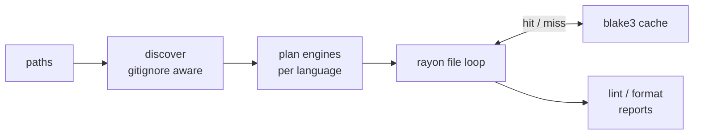

<!-- markdownlint-disable MD033 MD041 -->
<div align="center">


**One binary. ~30 languages. No toolchain to install.**

poly lints and formats whole repositories in seconds: curated Rust backends for the languages
that matter, a tree-sitter fallback for everything else, and a Claude/Codex plugin plus an MCP
server so agents can drive it directly instead of shelling out.

Lint + format · one `poly.toml` · pure Rust, zero deps · blake3 cache + rayon parallelism · git
hooks & commit checks · MCP + Claude/Codex plugin

[](https://github.com/Goldziher/poly/actions/workflows/ci.yaml)
[](LICENSE)

[Install](#installation) · [What You Get](#what-you-get) ·
[AI Agents & MCP](#ai-agents--mcp) · [Performance](#performance) ·
[Configuration](#configuration) · [CLI](#cli-reference) · [Contributing](#contributing)

</div>

---

## What You Get

<!-- markdownlint-disable MD013 -->

| Capability | What it does |
|---|---|
| **Fast on real repos** | Lints Django in 0.82s and home-assistant's 25,000 files in 3.5s, cold cache; see [Performance](#performance). |
| **One binary, no toolchain** | ~30 languages with native Rust backends (ruff, oxc, biome, mago, taplo, rumdl, sqruff, malva, markup_fmt, rubyfmt, …) plus a tree-sitter tier for everything else. No Node, Python, or Ruby needed. |
| **Built for agents** | A Claude/Codex plugin and a stdio MCP server ship in the box — an agent calls poly's tools directly instead of shelling out and parsing text. See [AI Agents & MCP](#ai-agents--mcp). |
| **One config** | `poly.toml` drives linting, formatting, git hooks, and commit-message policy. |
| **Cache + parallelism** | A blake3 content-hash cache skips unchanged work; rayon parallelizes the rest across cores. |
| **Git hooks & commit checks** | `poly hooks install` wires lint, format, and Conventional-Commit checks into git — no external hook framework. |
| **Two lint tiers on every language** | A code-quality metrics engine and a 26-rule built-in ast-grep pack run on top of the backends above, on by default at warning severity so they never redden an unconfigured CI. |
| **Simple distribution** | Prebuilt binaries via a shell/PowerShell installer, a GitHub Action, Homebrew, Scoop, npm, and PyPI. |

<!-- markdownlint-enable MD013 -->

---

## Installation

### Quick install

```sh
curl -fsSL https://raw.githubusercontent.com/Goldziher/poly/main/install.sh | sh
```

Windows PowerShell:

```powershell
irm https://raw.githubusercontent.com/Goldziher/poly/main/install.ps1 | iex
```

Both detect the platform, download the matching release archive, and verify it against
`sha256sums.txt`. Set `POLY_VERSION=0.23.0` to pin an exact release.

### GitHub Actions

```yaml
- uses: Goldziher/poly@v0
  with:
    version: v0.23.0 # omit for the latest release
```

Forwards to `install.sh` and caches the installed binary by version and platform. See
[`ACTION_USAGE.md`](ACTION_USAGE.md) for the full input/output reference.

### Package managers

```sh
brew install Goldziher/tap/poly
```

```powershell
scoop bucket add goldziher https://github.com/Goldziher/scoop-bucket
scoop install poly
```

Homebrew's tap is a single rolling formula with no versioned alias yet — treat it as a
get-latest channel and use the installer script or the GitHub Action where a pinned version
matters. `cargo binstall --git https://github.com/Goldziher/poly poly-cli` also works, resolving
the same GitHub release archives.

### npm and PyPI

```sh
npm i -g @goldziher/polylint
pip install polylint
```

Both install the same prebuilt `poly` binary. The package is named `polylint` (the unscoped
`poly` name belongs to unrelated projects on both registries), but **the executable is `poly`
on every channel** — `polylint` also works everywhere as an alias for the same binary. Full
per-platform detail in [docs/INSTALL-PACKAGES.md](docs/INSTALL-PACKAGES.md).

### As an agent plugin

poly ships its own Claude/Codex plugin, registering `poly mcp` as a stdio server plus 5 skills
and 2 slash commands (`/poly-check`, `/poly-fix`):

```text
/plugin marketplace add Goldziher/poly
/plugin install poly@poly
```

Codex: add the `Goldziher/poly` marketplace through your client's plugin manager (manifest at
`.codex-plugin/plugin.json`). The plugin assumes `poly` is already on `PATH` — it does not
bundle the binary — and its version tracks the `poly` binary version lock-step. See
[AI Agents & MCP](#ai-agents--mcp).

### As an MCP server

Any MCP-capable client can run poly directly:

```json
{
  "mcpServers": {
    "poly": { "command": "poly", "args": ["mcp"] }
  }
}
```

---

## Quickstart

```console
$ poly lint
./app.py
  warning  ruff  T201  5:5  `print` found
  warning  ruff  ANN201  4:5  Missing return type annotation for public function `main`
  error  ruff  F401  1:8  `os` imported but unused

3 issues found.
  2 files linted
  1 issue fixable with the `--fix` option

$ poly fmt --check
would reformat ./src/main.rs

1 file will change.
  2 files checked

$ poly fmt --fix
reformatted ./src/main.rs

1 file reformatted.
  2 files checked

$ poly hooks install
✓ Installed 2 git hooks in .git/hooks
  › commit-msg
  › pre-commit
```

`poly fmt` is a dry run by default (CI-friendly); add `--fix` to write changes, and `poly lint
--fix` to apply lint autofixes. `poly hooks install` wires the git hooks once — lint, format, and
commit checks then run on every `git commit`.

Exit codes are a contract: `0` is clean, `2` means the run verified less than it claims, and `1`
means findings — which for `poly fmt --fix` reports *that files were rewritten*, so a script
running it in fix mode should treat `1` as success. Add `-q` to trim the per-file detail on a
large repository; the summary keeps every count and reason.

---

## Demos

Real recordings, not mockups — `vhs` runs each command live, so the timings on screen are the
timings you get. Tapes are in [`docs/media/tapes/`](docs/media/tapes/).

**Kubernetes: 31,303 files, one binary, no Go toolchain.**


**Django is not a Python repo** — it is Python, JavaScript, CSS, HTML, TOML, YAML and Markdown.
One tool, one config, one pass.


**Every report has a machine-readable form.** `--format toon` is compact enough to hand to an
agent without burning its context; `--format json` is there when you want a document to parse.


**And an agent can skip the terminal entirely.** `poly mcp` speaks MCP over stdio and advertises
the same eleven tools the CLI exposes.


---

## How It Works

<details open>
<summary><strong>Pipeline</strong></summary>

poly discovers files once, plans engines once per language, and runs the per-file work in
parallel on a rayon pool. Every backend returns the same `Diagnostic` / `FormatOutput` shapes, so
reporting, caching, and MCP output stay uniform.


```mermaid
flowchart LR
  A["paths"]
  B["discover<br/>gitignore aware"]
  C["plan engines<br/>per language"]
  D["rayon file loop"]
  E["blake3 cache"]
  F["lint / format<br/>reports"]
  A --> B --> C --> D
  D <-->|hit / miss| E
  D --> F
```

</details>

<details>
<summary><strong>Zero-dependency default</strong></summary>

The default path needs no Python, Node, Go, JVM, or project-local toolchain — most backends are
Rust crates compiled into the binary. `gofmt`, `rustfmt`, and `shellcheck` run automatically when
present on `PATH`; every other native-toolchain wrapper (`zig fmt`, `shfmt`, …) and every catalog
tool is opt-in. A language with no dedicated backend falls through to a tree-sitter generic tier —
still pure Rust, still zero system deps.

</details>

<details>
<summary><strong>Cache</strong></summary>

The result cache is keyed by file bytes, engine name, engine version, and resolved engine config —
a tool upgrade or config change invalidates exactly the entries it affects. `--debug` reports
per-file engine timing and cache hit/miss data.

</details>

---

## AI Agents & MCP

poly ships its own agent integration rather than expecting one to be bolted on: a Claude/Codex
plugin and a stdio MCP server exposing the same lint/format/cache surface as the CLI, with
structured output an agent can consume directly.

### Plugin

```text
/plugin marketplace add Goldziher/poly
/plugin install poly@poly
```

Installs 5 skills and 2 slash commands (`/poly-check`, `/poly-fix`) that teach an agent poly's
tiered backend model and when to reach for lint vs. format vs. hooks.

### MCP tool surface

Eleven tools, mirroring the CLI 1:1:

<!-- markdownlint-disable MD013 -->

| Tool | Mirrors | Kind |
|---|---|---|
| `lint` | `poly lint` | read-only |
| `format_check` | `poly fmt --check` | read-only |
| `rules` | `poly rules list` / `test` | read-only |
| `config_show` | `poly config show` | read-only |
| `cache_stats` | `poly cache stats` | read-only |
| `version` | `poly --version` (plus build id, channel, pid) | read-only |
| `lint_fix` | `poly lint --fix` | mutating |
| `format_write` | `poly fmt --fix` | mutating |
| `cache_clean` | `poly cache clean` | mutating |
| `workspace_lint` | the whole-project phase, check mode | async task |
| `workspace_lint_fix` | the whole-project phase, fix mode | async task |

<!-- markdownlint-enable MD013 -->

`workspace_lint` / `workspace_lint_fix` run `cargo clippy` / `cargo-sort` / `cargo-machete` /
`cargo-deny` and any configured whole-project checkers — a multi-minute operation — so both are
exposed as async **Tasks**: the call returns a handle and the client polls `tasks/get`. A client
that doesn't declare the tasks capability gets a synchronous result from the same call instead.

Every result carries a `poly` identity block (version, build id, channel, executable, pid), so an
agent knows which binary answered — an MCP caller has no `poly --version` to fall back on.
Results also distinguish three per-file outcomes: **checked**, **skipped** (poly correctly
declined the file), and **errored** (poly failed on a file it accepted) — `isError` is set
whenever anything errored, so an agent can gate on it before trusting the rest of the payload.

Full parameter reference: [`.ai-rulez/skills/poly-mcp/SKILL.md`](.ai-rulez/skills/poly-mcp/SKILL.md).

---

## Performance

Release build, Apple Silicon, cold cache (`--no-cache`), best of three runs on an idle machine.
`poly lint --no-workspace` and `poly fmt --check` over the whole repository, counting the files
poly actually inspected. These are poly's own numbers — **not** a comparison against ruff,
oxlint, biome or anything else; no such benchmark was run.

<!-- markdownlint-disable MD013 -->

| Project | `poly lint` | Findings | Peak RSS | `poly fmt --check` |
|---|---|---|---|---|
| Django | 3,113 files in **0.82s** | 66,839 | 0.21 GB | 5,539 files in 0.30s |
| home-assistant | 25,443 files in **3.5s** | 376,829 | 0.48 GB | 25,559 files in 1.2s |
| Kubernetes | 21,657 files in **6.8s** | 41,576 | 0.40 GB | 21,824 files in 12.9s |
| prettier | 7,057 files in **1.9s** | 19,373 | 0.40 GB | 7,450 files in 0.44s |
| TypeScript | 32,606 files in **13.3s** | 179,586 | 0.52 GB | 40,012 files in 4.0s |

<!-- markdownlint-enable MD013 -->

Kubernetes is the one repository where formatting costs more than linting: its Go files go
through `gofmt`, the one backend that is a subprocess rather than a linked-in crate, and ~20,000
process spawns dominate the run.

The blake3 cache and rayon parallelism (see [How It Works](#how-it-works)) are what keep repeat
runs fast — Django re-lints in 0.71s warm against 0.82s cold: a cache hit skips the engine
entirely, and everything else is split across cores.

---

## Configuration

A single `poly.toml` at the repo root drives linting, formatting, hooks, and commit policy;
`poly.local.toml` layers local overrides on top, and nested `poly.toml` files cascade in a
monorepo.

```toml
[defaults]
line_length = 120
line_ending = "lf"
final_newline = true
trim_trailing_whitespace = true

[lint.python.ruff]
select = ["E", "F", "W"]

[lint.javascript.oxc.rules.max-params]
max = 6

[per-file-ignores]
"tests/**" = ["F401"]

[hooks]
stages = ["pre-commit"]

[hooks.builtin]
lint = true
fmt = true
commit = { stages = ["commit-msg"] }
```

`poly config show` prints the effective, fully-merged configuration (`--format toml|json|toon`)
after `extends` bases, the monorepo cascade, and `poly.local.toml` have all been applied — and
poly reports unknown keys, unknown sections, and wrongly-typed values as warnings rather than
silently ignoring them.

The full reference — default rule selection, inline suppression, monorepo cascading, shared and
remote config, custom ast-grep rules, code-quality metrics, and comment removal — lives in
[docs/CONFIGURATION.md](docs/CONFIGURATION.md).

---

## Backend Coverage

poly resolves each file through a tiered model: a curated Rust backend where one exists (ruff,
oxc, biome, mago, taplo, rumdl, sqruff, malva, markup_fmt, rubyfmt, and more), a native-toolchain
CLI where no viable Rust library exists (`gofmt`, `rustfmt` and `shellcheck` run automatically
when present; `zig fmt`, `shfmt`, `ktfmt`, `google-java-format`, `swift-format`, `dart format`,
`styler` and `gleam format` are opt-in), and a tree-sitter generic tier for everything else. An opt-in catalog of 348 tools
across 175 languages covers the long tail beyond that.

<!-- markdownlint-disable MD013 -->

| Language | Backend | Lint | Format |
|---|---|---:|---:|
| JavaScript / TypeScript / JSON | oxc | yes | yes |
| Python | ruff internals | yes | yes |
| TOML | taplo | yes | yes |
| Markdown | rumdl | yes | yes |
| SQL | sqruff | yes | yes |
| YAML | saphyr + pretty_yaml | yes | yes |
| CSS / SCSS / Less | malva + biome | yes | yes |
| HTML / Vue / Svelte / Astro | markup_fmt | no | yes |
| PHP | mago | yes | yes |
| Ruby | rubyfmt | no | yes |
| Nix | alejandra | no | yes |
| Go | `gofmt` (default-on) | no | yes |
| Rust | `rustfmt` (default-on) | no | yes |
| Shell | `shellcheck` (default-on), opt-in `shfmt` | yes | optional |
| Everything else identified | tree-sitter generic tier | no | best effort |

<!-- markdownlint-enable MD013 -->

Full table (~30 languages with dedicated backends) plus the 348-tool catalog:
[docs/BACKENDS.md](docs/BACKENDS.md).

---

## Hooks

```sh
poly hooks install
```

wires `poly.toml`'s `[hooks]` into native git hooks — lint, format, commit-message, and
file-safety checks, plus whole-workspace tools like `cargo clippy` — replacing a
`.pre-commit-config.yaml` and its external framework dependency. Hooks validate a staged
snapshot of the git index by default, run concurrently, and cache their own results.

Full reference — builtin hooks, staged isolation, timeouts, concurrency, caching, and
git-hosted hook catalogs: [docs/HOOKS.md](docs/HOOKS.md).

---

## CLI Reference

```text
poly lint [PATHS]...   --fix --format pretty|json|toon --no-cache -j <N> --exclude <GLOB>
poly fmt [PATHS]...    --check (default) --fix
```

Both share `--config <PATH>`, `--no-color`, `-q` / `--quiet`, `--verbose`, `--debug`,
`--force-exclude` / `--include-excluded`, `--fix-generated`, and `--deny-skips` /
`--max-skips <N>`. `poly lint` adds `--no-workspace` / `--workspace` to control the
whole-project phase.

`--quiet` trims pretty output to the findings and the summary — every count and reason stays,
only the itemised per-file list goes away. Runs longer than 400 ms draw a progress indicator on
stderr, but only when stderr is a terminal, so pipes, files and CI logs see nothing.

| Exit code | Meaning |
|---:|---|
| 0 | Clean. |
| 1 | Error-severity lint findings, a failing whole-project tool, or (`poly fmt`) files that would change. |
| 2 | The run verified less than it claims — a file poly failed on, a skip budget exceeded, a config error, or a report that failed to serialize. |

Other subcommands: `poly hooks`, `poly commit`, `poly rules test|list`, `poly config
update|show`, `poly cache`, `poly migrate`, `poly mcp`, `poly doctor`.

Full flag-by-flag reference: [docs/CLI.md](docs/CLI.md).

---

## Workspace Layout

```text
crates/
├── poly-core/       # Engine trait, registry, discovery, runner, reports
├── poly-config/     # poly.toml schema and config loading
├── poly-cli/        # poly umbrella CLI
├── gitfluff/        # Conventional Commit linter
├── poly-hooks/      # git-hook runner
├── poly-mcp/        # MCP stdio server
├── poly-workspace/  # whole-project lint orchestration (shared by poly-cli and poly-mcp)
├── poly-cache/      # blake3 result cache
├── poly-catalog/    # embedded mdsf tool catalog
├── poly-buildinfo/  # build identity folded into the cache key
└── conformance/     # differential test harness
```

---

## Contributing

Keep changes small and test-backed. A new or changed backend needs known-bad and
known-unformatted fixtures under `crates/poly-core/tests/`, and must preserve the uniform
`Engine` boundary. Before committing:

```sh
poly hooks install   # wires lint/format/cargo checks into git; they run on every commit
cargo test --workspace --no-fail-fast
```

---

## License

MIT - see [LICENSE](LICENSE).
