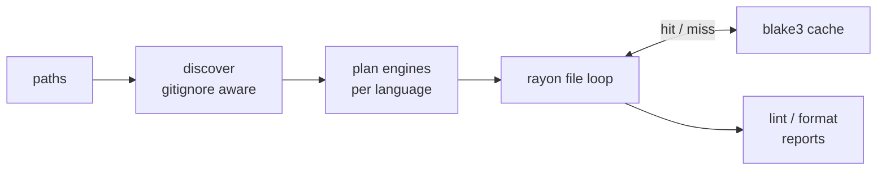

import { Aside, CardGrid, Card, LinkCard, Steps } from '@astrojs/starlight/components';

poly is a single binary that lints and formats every language in a repository. It exists because
the alternative — ruff for Python, oxlint for TypeScript, `rustfmt` for Rust, `gofmt` for Go,
prettier for CSS, a YAML linter, a TOML formatter, and a hook framework to orchestrate them —
means a toolchain per ecosystem, a config file per tool, and a different report format from each.

poly compiles those tools in as **Rust crate dependencies** and runs them in-process. There is no
subprocess, no `node_modules`, no virtualenv, and nothing to install beyond the binary itself.

## The coverage tiers

Every file resolves through the same ladder. Nothing here is a fallback you should avoid — the
lower tiers are the coverage mechanism, and a language can be promoted upward later without any
change to how you invoke poly.

<Steps>

1. **Native Rust backends (tier 1).** The highest-fidelity path: ruff for Python, oxc for
   JavaScript/TypeScript/JSON, taplo for TOML, rumdl for Markdown, sqruff for SQL, malva for
   CSS/SCSS/Less, mago for PHP, `markup_fmt` for HTML/Vue/Svelte, and more. All compiled in, all
   in-process.

2. **Tree-sitter generic tier (tier 2).** The catch-all for everything else — Java, Elixir, C,
   C++, protobuf, and the long tail of 300+ grammars. Best-effort structural reindent, still pure
   Rust, still no system dependency. Tier 2 is **formatting only**: it establishes no lint
   coverage.

3. **Native-toolchain backends.** For languages whose canonical formatter is a first-party CLI with
   no usable Rust library. `rustfmt`, `gofmt` and `shellcheck` run automatically when present on
   `PATH`; `zig fmt`, `shfmt`, `google-java-format`, `ktfmt`, `swift-format`, `dart format`,
   `gleam format` and `styler` are opt-in. When the tool is absent the language simply falls
   through to tier 2.

4. **Catalog tier.** Any of 348 tools from the embedded catalog, enabled per tool with
   `[tools.<name>] enabled = true`. Probed on `PATH`; a missing binary is a no-op, never an error.

</Steps>

On top of all four, two **cross-cutting** lint tiers run on every language, both on by default at
*warning* severity so adopting poly never reddens an unconfigured CI:

- The native **code-quality engine** — file and function length, parameter count, nesting depth,
  cyclomatic complexity, and lazy ignore markers. It defers to a tier-1 backend wherever one
  already reports the same measurement, so no metric is reported twice.
- The built-in **ast-grep rule pack** — 26 rules across C#, Elixir, Go, Java, Kotlin, Python,
  Ruby, Rust and Swift, embedded in the binary and loaded through the same parser as your own
  custom rules.

<Aside type="tip" title="Zero-dependency is a guarantee, not a default">
    A machine with only the `poly` binary on it still lints and formats the whole repository. The
    native-toolchain and catalog tiers raise fidelity where their tools happen to be installed;
    their absence lowers fidelity and is never an error.
</Aside>

## How a run works

poly discovers files once, plans engines once per language, then runs the per-file work in
parallel on a rayon pool.



Every backend returns the same diagnostic and format-output shapes, so reporting, caching and MCP
output stay uniform no matter which tool produced a finding.

The result cache is keyed by the file's bytes, the engine name, the engine version and the
resolved engine config — so a tool upgrade or a config change invalidates exactly the entries it
affects and nothing else. It lives in the per-user OS cache directory, never in the repository.

## Coverage is accounted for, not assumed

A linter that silently checks nothing is worse than one that fails. poly counts every file it
declined and says why:

```console
$ poly lint --verbose .
skipped main.zig: no lint rules for Zig
```

Skips have several sources: a language nothing in the run lints, no matching engine, a file poly
deliberately withholds a write from, a binary file, or an engine the caller withdrew with
`--only`/`--skip` or `enabled = false`. All of them appear in the summary and the `--format json`
payload, but only the ones naming a limit of poly count against `--deny-skips` / `--max-skips` — a
caller instruction never does, since it already says so in its own name (see
[Coverage and withdrawal](/poly/guides/configuration/#coverage-and-withdrawal)). A run that verified
less than it claims exits **2**, distinct from the **1** that means real findings.

<Aside type="caution" title="`poly lint` is not read-only by default">
    After the per-file tier, `poly lint` runs a **whole-project phase** that executes the configured
    whole-workspace tools (`cargo clippy`, `cargo sort`, `cargo machete`, `cargo deny`, any
    configured type checker) against the live worktree. poly writes nothing without `--fix`, but
    those tools have their own side effects — `cargo clippy` populates `target/` and can refresh
    `Cargo.lock`. Pass `--no-workspace`, or set `[lint] workspace = false`, for a run that must
    leave the tree untouched.
</Aside>

## Where to go next

<CardGrid>
    <LinkCard title="Installation" href="/poly/start/installation/" description="Every channel, and what each one actually installs." />
    <LinkCard title="Quickstart" href="/poly/start/quickstart/" description="First lint, first format, first hook install." />
    <LinkCard title="Backend coverage" href="/poly/reference/backends/" description="The language-by-language table." />
    <LinkCard title="Configuration" href="/poly/guides/configuration/" description="Everything poly.toml can say." />
</CardGrid>
